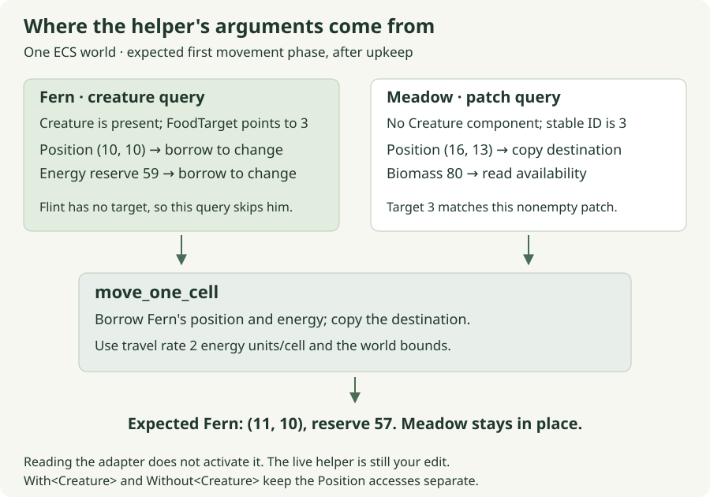

<p class="eyebrow">Chapter 1 · State, proposals and mutation</p>

# One step that Fern can afford

Fern has somewhere to go. The fixture gives her Meadow's stable ID as a
destination, and the prepared movement system can find that patch. What it
cannot yet do is take a step. One function in the middle is waiting for its
rule: decide whether the next cell is valid, whether Fern can pay for it, and
what to change when she can.

This is a good first contribution because its result has three visible parts.
Fern changes cell, her reserve changes by the price of the distance, and the
function returns how far she actually traveled. A rejected attempt must keep
all three accounts consistent.

## Your first edit

Use your existing Moss checkout, or [prepare the edition's starter](../reference/start-here.md)
if you are joining from the public book.

Open `crates/moss-sim/src/lessons.rs` and find **`move_one_cell`**. Replace that
function's unfinished body. Its signature, caller and focused test already
exist. The [complete replacement](#the-complete-worked-replacement) is below;
use as much of it as helps while you regain your bearings.

From the repository root, run the prepared checkpoint:

```sh
scripts/with-toolchain.sh cargo test -p moss-sim --locked --test movement movement_charges_only_an_affordable_actual_step -- --exact
```

The original development checkout includes a RustRover Run configuration named
**Moss - Movement test**. In the downloadable starter, use the command above in
RustRover's terminal or create a Cargo test configuration with those arguments.
Before your edit, expect one selected test to fail with:

```text
not yet implemented: Paired movement exercise: propose, validate, then commit one step
```

That result tells us the project compiled and reached the intended function.
It has not yet tried a wrong movement rule; it stopped at the placeholder.
A compiler diagnostic or zero matching tests means something different and
deserves fixing before reasoning about the rule.

**The first stopping point is that one named test passing.** Review and activation
come afterward. The browser currently runs maintenance only, so watching it
before activation cannot tell you whether an otherwise correct helper works.

## Think about a step before taking it

Use smaller coordinates than the browser world for the first calculation.
Fern starts at `(2, 2)`, the target is `(4, 4)`, and travel costs **2 energy
units per cell**. Today's rule moves at most one cardinal cell per call,
changing x before y. Her proposed next position is therefore `(3, 2)`.

With a reserve of 59, that step costs 2 and leaves 57. With a reserve of 1,
the same step is unaffordable. Moving first and then clamping subtraction
at zero would give Fern travel she could not pay for. The rejection case
is what makes the order of our writes matter.

| Starting reserve | Result of the same proposed step |
| --- | --- |
| 59 energy units | Move to `(3, 2)`, retain 57, return 1 cell. |
| 2 energy units | Move to `(3, 2)`, retain 0, return 1 cell. |
| 1 energy unit | Stay at `(2, 2)`, retain 1, return 0 cells. |

The exact-price case matters. An animal with 2 can pay a cost of 2. The guard
must reject `reserve < cost`; rejecting `reserve <= cost` would forbid that
valid step.

### At the workbench: a proposal is not the real position

The model below separates three moments that are almost adjacent in the Rust
function. Start with 59, then change reserve to 1 and repeat. Watch the original
position while the proposal changes. It should move only at an accepted commit.

<section class="lab" data-lab="movement" aria-label="One affordable step teaching model">
<div class="lab-heading"><span class="lab-kind">Interactive teaching model</span><strong>A step in three moments</strong></div>
<p>This model illustrates the rule. It does not run the live Rust simulation.</p>
<div class="lab-controls">
<label>Starting reserve <input data-input="reserve" type="number" min="0" max="100" value="59" disabled> energy units</label>
<label>Travel rate <input data-input="rate" type="number" min="0" max="10" value="2" disabled> energy units/cell</label>
<label>Case <select data-input="case" disabled><option value="east">Both axes differ: (2, 2) → (4, 4)</option><option value="north">Only y differs: (2, 2) → (2, 4)</option><option value="arrived">Already there: (2, 2) → (2, 2)</option><option value="invalid">Invalid target: (2, 2) → (−1, 2)</option></select></label>
</div>
<div class="lab-state" data-output="diagram"></div>
<div class="lab-actions"><button type="button" data-action="advance" disabled>1. Propose</button><button type="button" data-action="reset" disabled>Reset attempt</button></div>
<p class="lab-explanation" data-output="explanation" role="status" aria-live="polite">Enable JavaScript to inspect each phase interactively. The table above gives the same accepted and rejected outcomes.</p>
</section>

The first change is to a tentative value. The second moment asks whether it is
allowed. The final moment writes the accepted result. This structure is useful
well beyond movement: whenever one action must change several values together,
deciding before writing keeps rejection from needing an undo path.

## What the references let us change

Here is the **existing signature**, with its body omitted for discussion:

```rust
pub fn move_one_cell(
    position: &mut Position,
    energy: &mut Energy,
    target: Position,
    units_per_cell: u32,
    config: WorldConfig,
) -> u32
```

The first two parameters are mutable references. They give this call temporary,
exclusive access through which it can change the caller's `Position` and `Energy`.
The remaining values arrive by value. `Position` and `WorldConfig` are small
`Copy` types here, so passing the destination and configuration does not transfer
away the caller's ability to use them.

The `mut` in `&mut Position` describes the kind of reference. A local binding
such as `let mut next` answers a separate question: may this local value change?
That distinction becomes concrete in the first useful line of the body:

```rust
let mut next = *position;
```

`position` is a reference; `*position` accesses the value it refers to. Because
`Position` implements `Copy`, assigning that value to `next` makes an independent
position. Changing `next.x` changes the proposal. It does not reach back through
the reference and change Fern.

Later, `*position = next` does reach through the reference. It replaces the
caller's position with our accepted proposal. The same `*` syntax participates
in both expressions, but the assignment's left side is the crucial difference:
we are now writing to the original place.

The official Rust book's [references and borrowing chapter](https://doc.rust-lang.org/book/ch04-02-references-and-borrowing.html)
is useful here if the distinction between a reference and the value behind it
still feels slippery. Return with this one question: which assignment changes
the caller's value?

## The complete worked replacement

**Worked reference — replace only `move_one_cell` in
`crates/moss-sim/src/lessons.rs`.** The file already imports the types used here.
Remove the existing placeholder; do not append another function with the same
name. This exact answer is also maintained in the current v2 guide.

<!-- moss-example: movement-v2-helper -->
```rust
pub fn move_one_cell(
    position: &mut Position,
    energy: &mut Energy,
    target: Position,
    units_per_cell: u32,
    config: WorldConfig,
) -> u32 {
    let in_bounds = |p: Position| {
        (0..config.width() as i32).contains(&p.x) && (0..config.height() as i32).contains(&p.y)
    };
    if !in_bounds(*position) || !in_bounds(target) {
        return 0;
    }

    let mut next = *position;
    if next.x != target.x {
        next.x += if next.x < target.x { 1 } else { -1 };
    } else if next.y != target.y {
        next.y += if next.y < target.y { 1 } else { -1 };
    }

    let distance = position
        .x
        .abs_diff(next.x)
        .checked_add(position.y.abs_diff(next.y))
        .expect("step distance overflow");
    let cost = distance
        .checked_mul(units_per_cell)
        .expect("movement cost overflow");
    if energy.reserve < cost {
        return 0;
    }

    *position = next;
    energy.reserve -= cost;
    distance
}
```

### The guard comes before the proposal

`in_bounds` is a closure: a local callable value. Its `|p: Position|` names
one argument. A coordinate is valid when both axes lie inside their ranges.
The range `0..width` includes zero and excludes width; width 32 permits x
from 0 through 31. Signed coordinates let us represent an invalid −1 and
reject it deliberately. The casts to `i32` fit because `WorldConfig` validates
dimensions in the range 8–256.

Rejecting an invalid start matters as much as rejecting an invalid destination.
Otherwise a helper might quietly walk a malformed entity back into the world,
concealing the state that should have prompted investigation. Our selected
contract rejects either case without mutation.

### An `if` can produce a number

In `next.x += if next.x < target.x { 1 } else { -1 };`, the inner `if` evaluates
to an integer. Rust's branches can supply values, so we use the direction
comparison to choose an increment rather than assigning it in a separate block.

The outer `else if` preserves x-before-y. Two independent `if` statements
would be a different movement rule: when both coordinates differ, they could
change both axes. Diagonal travel is not inherently wrong. It is wrong for
this function's stated one-cardinal-cell contract and its prepared test.

### A number needs a unit and an account

The proposed distance is the absolute x change plus the absolute y change.
Under this rule it is 0 or 1 **cell**. Multiplying by **energy units per cell**
produces the proposed cost in **energy units**. The type `u32` alone does not
encode that distinction; the names, signature and contract supply it.

`checked_add` and `checked_mul` return an `Option`, because an arithmetic result
might not fit its integer type. `expect` takes the successful value or stops
with the given explanation if the arithmetic assumption fails. These checks
protect representability. The subsequent comparison protects affordability.
An affordable action and a representable calculation are different questions.

Nothing has changed in the caller yet. Only after the guard accepts the cost
do we assign the proposed position and subtract the energy. The final
`distance` has no semicolon because it is the function's returned expression.
Writing `distance;` would discard that value and leave the body returning `()`,
which does not match `-> u32`.

## A test should notice the mistake we care about

The prepared test lives in `crates/moss-sim/tests/movement.rs`. Its first case
constructs position `(2, 2)`, reserve 59, target `(4, 4)` and rate 2. After the
call it checks the returned distance **and** the new position **and** the new
reserve. A function that returns 1 without writing anything should fail.

Later cases make the question sharper. A reserve of 1 must reject without
mutation; an exact reserve of 2 must pay successfully; a rate of 3 must charge
3. That last case catches a plausible shortcut: hard-coding the default price
can pass all the default-price examples while ignoring the supplied argument.

There is another small lesson in the low-energy case. The test performs its
first successful step, then changes the reserve to 1. Position is already
`(3, 2)` at that point. Each call does not reset the fixture automatically.
Trace the values as the test changes them instead of mentally restarting the
animal at the beginning of every assertion.

Run the exact command from the opening again. A single named test passing is
the checkpoint. If it still stops at `todo!()`, confirm that the saved file
contains the replacement body. If only the rejection assertion fails, inspect
whether a write happens before the affordability guard. If zero tests ran,
check the target and exact name; an empty selection is not evidence of success.

### One nearby variation

Keep the target `(4, 4)` and the rate 3. Compare a fresh reserve of 3 with a
fresh reserve of 2. The first can travel to `(3, 2)` and finish at zero. The
second stays at `(2, 2)` with 2. The result follows from the supplied rate,
not from the animal's species or from how much energy movement usually costs.

**Stop for review once the helper passes.** A useful review request is:

> The affordable-step test passes. Please review the bounds, borrowed writes
> and payment order, then activate the prepared adapter and verify the journey.

## How the little function reaches an ECS world

The helper knows about two mutable values, a destination and configuration.
It does not search a world, decide which animal is hungry, or draw a sprite.
Those jobs have separate places in the program, which keeps this rule testable
without a browser or renderer.

An **entity** is an identity to which components can be attached. A **component**
stores one kind of data, such as `Position`, `Energy` or `FoodTarget`. A **system**
is a function that declares the data it needs; a **schedule** decides when
systems run. In the prepared adapter, those declarations let an ECS query
supply the values your ordinary helper needs.



[Open the ECS adapter diagram at full size](../../../docs/tutorial/visuals/adapter-to-helper.svg).

*One world supplies both sides. The destination is copied; Fern's changing
values are borrowed. This is the expected call after activation.*

The animal query is this **parameter excerpt** from `move_to_food`:

```rust
mut creatures: Query<(&FoodTarget, &mut Position, &mut Energy), With<Creature>>,
```

All three component types are required. `With<Creature>` additionally restricts
membership to entities carrying that marker. The query reads each matching
target and lends mutable access to position and energy. Flint has no authored
food target at this checkpoint, so he does not match, even though he is a
creature with position and energy.

A second query reads patches with `Without<Creature>`. This explicit separation
matters because both queries access `Position` and the animal query may write it.
The filters tell Bevy these two sets cannot overlap. Bevy's
system initialization can reject conflicting query access even when the Rust
parameter types compile. The disjoint filters establish why this pair is safe
to initialize together. Bevy's
[versioned Query reference](https://docs.rs/bevy_ecs/0.18.1/bevy_ecs/system/struct.Query.html)
explains the required-component and conflicting-access rules when you want the
API-level detail behind this example.

The adapter loops over matching animals, finds the target's stable ID among
nonempty patches, copies that patch's destination, and calls `move_one_cell`.
It borrows Fern's real components for your two mutable parameters. The helper's
final assignments therefore change simulation state, and presentation can
derive Fern's next sprite position from it.

The ECS entity handle and the stable `SimId` answer different needs. ECS uses
its handle to address a currently stored entity. Moss uses its application ID
to identify participants in inspection and history. A `FoodTarget` names the
stable ID; the adapter still needs to resolve it against a currently available
patch. A remembered ID alone is not proof that food still exists.

## From one correct call to one visible tick

The browser does not call biology once for every frame. It requests complete
simulation ticks. Within an activated movement tick, maintenance spends upkeep,
movement attempts the accepted step, and completion advances the clock.
Changing zoom or drawing more frames should not change the result of the same
executed ticks and accepted inputs.

The distinction explains a common debugging puzzle: a correct helper can
produce no visible movement when the adapter is unscheduled, when the entity
does not match its query, when the target is missing, or when the proposal is
rejected. Each possibility is a different link in the path. Inspecting them
separately is more useful than changing the arithmetic until something moves.

**Expected after reviewed activation:** Fern starts at `(10, 10)` with reserve
60. Maintenance spends 1; an accepted step spends 2. Her first tick ends at
`(11, 10)` with 57. Six x steps and three y steps reach Meadow at `(16, 13)`
after nine ticks, leaving `60 − 9 × 1 − 9 × 2 = 33`. The tenth tick has no
travel to pay for, so only upkeep applies and the reserve becomes 32.

These are acceptance values for the activated implementation. They are not a
claim that the current maintenance-only browser has already shown this journey.
The review should establish the helper, the installed schedule, the WASM build
and the browser observation as separate pieces of evidence.

At Meadow, Fern would still have no meal. Arriving changes a position;
transferring food into energy requires another rule. We now have a pattern
for that rule: inspect the available values, determine what is possible,
then commit the actual change.
