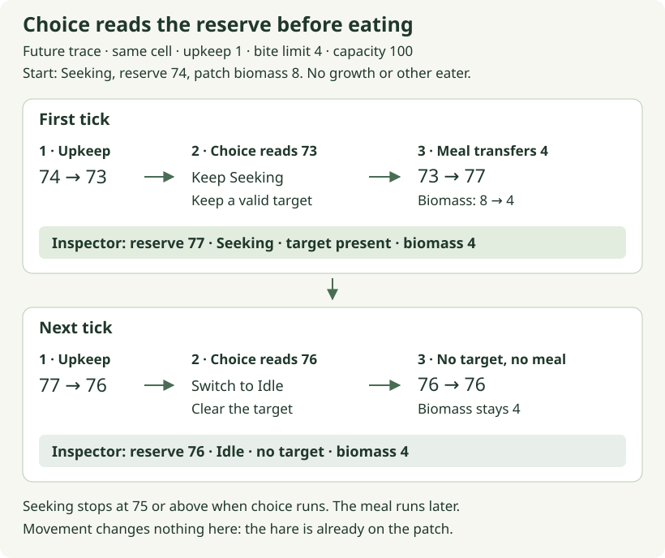

<p class="eyebrow">Chapter 3 · Observation, choice and remembered activity</p>

# Let the animal choose

Fern's first destination came from the fixture. It placed Meadow's stable ID
in her `FoodTarget`, and the movement rule could turn that instruction into
paid steps. The meal rule then gave arrival a consequence: energy entered Fern
as biomass left Meadow. We can keep both rules while changing who supplies
the destination.

That change has two parts. Fern needs to select an opportunity from nearby
food, and she needs a reason to seek food now. The nearest patch does not tell
us whether an already comfortable hare should walk toward it. Her current
reserve does not always tell us whether a meal already underway should stop.
We will give each question its own small function, then follow their results
into the same movement and eating rules.

**This chapter is a worked design beyond the edition's live checkpoint.**
Maintenance runs in the current project; movement is prepared but unfinished
and unscheduled, while choice and eating remain later work. The complete
examples below run independently of that live schedule. They do not install
autonomous behavior or replace the current movement exercise.

## On this page

- [Choose an edible opportunity](#what-can-fern-choose-from)
- [Remember whether Fern was seeking](#the-same-reserve-can-mean-two-things)
- [Connect activity to a target](#seeking-is-an-activity-a-target-is-an-opportunity)
- [Inspect choice before the meal](#why-can-fern-have-77-energy-and-still-be-seeking)

## What can Fern choose from?

Imagine Fern back at `(10, 10)`, with Meadow at `(16, 13)`. She needs six
horizontal steps and three vertical steps to arrive. A diagnostic search
radius of ten cells therefore includes Meadow: its distance is nine. This
radius is an authored setting for an observable example, not a statement about
the eyesight of real hares.

The selection rule uses **Manhattan distance**: the absolute difference in x
plus the absolute difference in y. In the current open grid, where a movement
step changes only one axis, that sum is the fewest cardinal steps between two
cells. Changing x before y determines which route Fern follows, but it does
not change the route's length. Obstacles would raise a new question; this
distance calculation does not find a path around them.

A diagonal makes the metric visible. In a separate small test, put Fern at
`(6, 6)` with a radius of four cells. Compare two patches that both hold food:

| Patch and cell | Cardinal distance and eligibility |
| --- | --- |
| ID 9 at `(10, 6)` | `4 + 0 = 4` cells. Eligible, including the radius-four boundary. |
| ID 8 at `(9, 8)` | `3 + 2 = 5` cells. Outside the radius. |


[Open the distance diagram at full size](../../../docs/tutorial/path/visuals/perception-distance.svg).

Read the boundary as a budget of cardinal steps. The eligible cells form a
diamond on the square grid. A straight line to patch 8 is only about 3.6 cells
long, so a circular range would include it and make it the nearer candidate.
That would be a different rule. The diagram and the test should agree about
which notion of distance the animal uses.

### Finding nothing is a meaningful answer

Distance is one filter. A patch also needs biomass. An empty patch on Fern's
own cell is less useful than edible grass a step away, even though its distance
is zero. These cases all end with no selection:

| Observations supplied to the helper | Why there is no target |
| --- | --- |
| No patches | There is nothing to inspect. |
| Only patches with zero biomass | The observed places cannot supply a meal. |
| Only nonempty patches beyond the radius | Food exists in the observations, but none is within this rule's reach. |

Rust's `Option<SimId>` lets the return type preserve that absence. `Some(id)`
contains a selected patch's stable identity; `None` means that no supplied
observation qualified. `None` does not claim that the whole world is empty,
and it is not a failure to execute the search. A successful search can establish
that there is currently nowhere suitable to go.

The ECS adapter will supply observations of grass patches for an eligible
grazer. The selection helper itself receives no species, ecological role or
energy reserve. Its small job is to compare candidate patches. Deciding that
Fern is a grazer who currently wants food belongs immediately around that
helper; Flint's hunter role must not acquire a grass target because he happens
to have an energy reserve too.

## Keep a best candidate, not a borrowed patch

Each observation contains a stable ID, a position and available biomass. The
parameter `patches: &[(SimId, Position, u32)]` borrows a slice of those tuples.
A slice gives access to a sequence of known element type and a length, without
requiring the function to own the caller's `Vec` or array. This shared borrow
allows inspection; the helper cannot reorder the supplied sequence or mutate
its tuples through it.

We only need to remember the strongest candidate seen so far. For this small
trace, put Fern at `(2, 2)` and supply patches 9, 4 and 3 in that order. The
first two are one cardinal step away; patch 3 is two away. All contain food.

| Observation just considered | Best candidate afterward |
| --- | --- |
| None yet | `None` |
| ID 9, distance 1 | `Some((1, SimId(9)))` |
| ID 4, distance 1 | `Some((1, SimId(4)))` |
| ID 3, distance 2 | Still `Some((1, SimId(4)))` |

The pair stores distance first, then ID. Rust compares these tuples from left
to right: the first unequal field decides the result. Patch 4 beats patch 9
because they share a distance and 4 is the lower ID. Patch 3 cannot win merely
by having the lowest ID; it loses at the distance comparison first.

This is a chosen tie policy. It gives the same answer when the observations
arrive in another order, which is useful when an ECS query supplies them.
Picking the first patch at the best distance would quietly make input order
part of the animal's behavior. A deliberate random tie-break could be a later
rule; it would need its own repeatability story.

An observation is also not a reservation. The biomass number says what was
available when the adapter read it. Another hare may receive a meal first.
Returning a stable ID allows the later action to find the actual patch and
check it again, using the current supply as the previous chapter required.

## The complete selection reference

This is the exact isolated answer from
[session 03](../../../docs/tutorial/path/03-finding-food.md). It imports the
project's existing `Position` and `SimId`, then declares a local helper and
test. The helper is proposed live behavior; it is not already implemented in
`lessons.rs`. When this becomes the active checkpoint, the agent prepares that
live function and its test before the learner edits its body.

Read the loop against the candidate table. The test below it supplies empty
food, a distant patch, reversed observations and the diagonal contrast, so
each part of the rule has something that could disprove it.

**Reading excerpt — `nearest_food` from the complete isolated reference below.**
The imports, local types and test fixtures remain in the expandable answer.

```rust
fn nearest_food(
    origin: Position,
    patches: &[(SimId, Position, u32)],
    radius_cells: u32,
) -> Option<SimId> {
    let mut best: Option<(u32, SimId)> = None;
    for &(id, position, biomass) in patches {
        if biomass == 0 {
            continue;
        }
        let distance = origin
            .x
            .abs_diff(position.x)
            .checked_add(origin.y.abs_diff(position.y))
            .expect("grid distance overflow");
        if distance > radius_cells {
            continue;
        }
        let candidate = (distance, id);
        let improves_choice = match best {
            None => true,
            Some(previous) => candidate < previous,
        };
        if improves_choice {
            best = Some(candidate);
        }
    }
    best.map(|(_, id)| id)
}
```

**Reference check — expected: one named test.** Run from the repository root:

```sh
python3 docs/tutorial/authoring/check_path_examples.py --session 03
```

<details class="worked-reference">
<summary>Complete food selection answer and test (61 lines)</summary>

<!-- moss-example: session-03 -->
```rust
use moss_sim::{Position, SimId};

fn nearest_food(
    origin: Position,
    patches: &[(SimId, Position, u32)],
    radius_cells: u32,
) -> Option<SimId> {
    let mut best: Option<(u32, SimId)> = None;
    for &(id, position, biomass) in patches {
        if biomass == 0 {
            continue;
        }
        let distance = origin
            .x
            .abs_diff(position.x)
            .checked_add(origin.y.abs_diff(position.y))
            .expect("grid distance overflow");
        if distance > radius_cells {
            continue;
        }
        let candidate = (distance, id);
        let improves_choice = match best {
            None => true,
            Some(previous) => candidate < previous,
        };
        if improves_choice {
            best = Some(candidate);
        }
    }
    best.map(|(_, id)| id)
}

#[test]
fn session_03_choices_survive_reordered_observations() {
    let origin = Position { x: 2, y: 2 };
    let mut patches = vec![
        (SimId(9), Position { x: 1, y: 2 }, 80),
        (SimId(4), Position { x: 3, y: 2 }, 80),
        (SimId(3), Position { x: 4, y: 2 }, 80),
        (SimId(1), origin, 0),
        (SimId(2), Position { x: 7, y: 2 }, 80),
    ];
    assert_eq!(nearest_food(origin, &patches, 2), Some(SimId(4)));
    patches.reverse();
    assert_eq!(nearest_food(origin, &patches, 2), Some(SimId(4)));
    assert_eq!(nearest_food(origin, &patches, 0), None);
    assert_eq!(nearest_food(origin, &[], 2), None);
    assert_eq!(
        nearest_food(origin, &[(SimId(8), origin, 1)], 0),
        Some(SimId(8))
    );

    let diagonal_case = [
        (SimId(8), Position { x: 9, y: 8 }, 80),
        (SimId(9), Position { x: 10, y: 6 }, 80),
    ];
    assert_eq!(
        nearest_food(Position { x: 6, y: 6 }, &diagonal_case, 4),
        Some(SimId(9))
    );
}
```

</details>

The first `continue` skips an empty patch. The second skips a patch beyond
the radius. Neither gets to challenge `best`, so an empty patch's tempting
distance of zero cannot defeat an edible candidate. Notice the boundary
comparison: `distance > radius_cells` excludes greater distances and admits
an exact match.

`abs_diff` computes an unsigned difference without assuming which coordinate
is larger. `checked_add` then adds the two axis distances. The supported small
world keeps these distances within range; the explicit overflow check makes
an unexpectedly large coordinate pair fail rather than silently turn into a
short distance. There is no useful geometric meaning to wrapping that sum.

The loop's pattern deserves a closer look because it is doing borrowing and
copying together. Iterating the shared slice yields references to its tuples.
In `for &(id, position, biomass)`, the leading `&` pattern opens one such
reference. The three names receive copies because `SimId`, `Position` and
`u32` all implement `Copy`. The original observations remain in the caller's
collection. Copying these small observations does not copy an ECS entity or
give the helper permission to change its biomass.

Compare that with the meal resolver's `for (id, energy) in eaters`: there we
iterated a mutable slice and bound mutable references to its fields. Here the
leading `&` unpacks a shared reference so the bindings hold copied observations.
One loop can change the caller's energy; the other only inspects its supplied data.

The `match` handles both forms of the running choice. With `None`, the current
candidate has nothing to beat. With `Some(previous)`, it must compare lower
than the previous pair. Each arm produces a `bool`, so the `match` expression
can initialize `improves_choice`. Both fields of the remembered pair are
`Copy`, allowing this inspection of `best` without making it unavailable for
the next loop iteration.

Finally, `best.map(|(_, id)| id)` changes the contents of a present option.
`Some((distance, id))` becomes `Some(id)`; `None` stays `None`. The bars enclose
a closure's argument, and `_` discards the distance that has finished its job.
The closure runs only for `Some`. We return a small owned identity, so the
answer does not keep a reference into the temporary observation slice.

Open the [standard-library `Option::map` reference](https://doc.rust-lang.org/std/option/enum.Option.html#method.map)
when a compact transformation obscures those two cases. Reading it as “change
the value if one is present” connects the method to the explicit `match` above.

### What the selection test can distinguish

The main fixture expects patch 4 before and after `patches.reverse()`. An
implementation that simply takes the first nearest patch would not preserve
that answer. The lower-ID patch 3 sits farther away, so comparing ID before
distance fails too. Patch 1 is on Fern's cell but empty; choosing it exposes
a missing biomass check.

Radius zero excludes every nonempty patch in that fixture, but it does not
mean “disable searching.” The separate same-cell case supplies one biomass
at distance zero and expects `Some(SimId(8))`. Its inclusion distinguishes an
empty neighborhood from a neighborhood whose only permitted cell is the
animal's current cell.

The diagonal case checks something the first fixture cannot. All its earlier
patches share Fern's y coordinate, where Manhattan and straight-line distances
agree. Requiring ID 9 for the diagonal comparison makes the chosen geometry
part of the evidence.

The command beside [the selection reference](#the-complete-selection-reference)
extracts the canonical guide's answer into a temporary workspace. The complete
block here is an exact copy; the command does not exercise an unfinished live
choice function or install
it. The [reference evidence](../../../docs/tutorial/path/verification.md)
records the checks separately from future integration.

**This is the first useful stopping point:** a decision with explicit absence,
distance and ties. Its tests need no creature to travel. The next question is
when Fern should ask for that decision at all.

## The same reserve can mean two things

Suppose Fern has 60 energy units out of a capacity of 100. She could be an idle
hare who has not needed to seek food yet. She could also have begun seeking
at 30 and recovered to 60 through meals. If both cases must immediately become
idle, she can abandon a useful activity as soon as one small meal nudges her
over a single threshold.

We can remember one fact: was she already seeking? The proposed
`ForagingState` enum has two alternatives, `Idle` and `Seeking`. It will belong
to the individual, because two hares at the same reserve can have different
recent activity. It does not contain a target, a timer or a plan.

For this first policy, an idle grazer begins seeking **below 45 energy units**.
A seeking grazer stops **at 75 or above**. Between those thresholds, preserve
the previous state. These are teaching settings for capacity-100 animals;
they are not yet evidence of balanced behavior.


[Open the activity transition diagram at full size](../../../docs/tutorial/path/visuals/seeking-state.svg).

Follow the outgoing arrow from the current state. At reserve 60, neither state
has an applicable transition, so both remain possible. The name for this
dependence on previous state is **hysteresis**. Here it is a small piece of
memory with a visible job: allow a foraging activity to continue through the
middle band instead of repeatedly switching around one boundary.

The reserve supplied to this decision has a precise place in the tick:
**after maintenance**. An idle Fern who starts at 45 pays one unit first,
arrives at 44, and starts seeking. A seeking Fern who starts at 76 arrives
at 75 and stops. A threshold that looks wrong in a completed-tick inspector
may have been evaluated against a different reserve earlier in that tick.

## The complete activity transition

This is the exact isolated reference from
[session 04](../../../docs/tutorial/path/04-when-to-seek.md). Its local enum
and helper demonstrate proposed state; the current live crate does not yet
contain this foraging-state implementation. The function returns the next
state without changing energy or a target.

**Reference check — expected: one named test.** Run from the repository root:

```sh
python3 docs/tutorial/authoring/check_path_examples.py --session 04
```

<!-- moss-example: session-04 -->
```rust
#[derive(Clone, Copy, Debug, PartialEq, Eq)]
enum ForagingState {
    Idle,
    Seeking,
}

fn next_foraging_state(previous: ForagingState, reserve: u32) -> ForagingState {
    match previous {
        ForagingState::Idle if reserve < 45 => ForagingState::Seeking,
        ForagingState::Seeking if reserve >= 75 => ForagingState::Idle,
        _ => previous,
    }
}

#[test]
fn session_04_the_middle_band_remembers_activity() {
    use ForagingState::{Idle, Seeking};

    assert_eq!(next_foraging_state(Idle, 44), Seeking);
    assert_eq!(next_foraging_state(Idle, 45), Idle);
    assert_eq!(next_foraging_state(Idle, 60), Idle);
    assert_eq!(next_foraging_state(Seeking, 60), Seeking);
    assert_eq!(next_foraging_state(Seeking, 74), Seeking);
    assert_eq!(next_foraging_state(Seeking, 75), Idle);

    let after_maintenance = 45_u32.saturating_sub(1);
    assert_eq!(next_foraging_state(Idle, after_maintenance), Seeking);
    let after_maintenance = 76_u32.saturating_sub(1);
    assert_eq!(next_foraging_state(Seeking, after_maintenance), Idle);
}
```

The `if` attached to each pattern is a **guard**: it narrows when that arm
matches. An idle value only takes the first arm when reserve is below 45.
A seeking value only takes the second when reserve is at least 75. The `_`
arm covers everything left and returns `previous`. Returning `Idle` there
would erase the very memory the middle band is meant to retain.

As with the selection helper's `match`, the chosen arm produces the result
of the whole expression. The two reserve-60 assertions are especially useful:
same energy, different previous state, different answer. The boundary pairs
44/45 and 74/75 establish exactly where the transitions occur. The final two
cases subtract maintenance explicitly to demonstrate the intended input;
they do not run the installed ECS schedule.

The command beside [the activity reference](#the-complete-activity-transition)
expects one named reference test to pass. As with selection, it exercises the
canonical guide's isolated answer. When this checkpoint becomes active,
the agent supplies the live test and its exact command; importing the actual
helper is what connects that later test to the learner's edit.

There is no cost for evaluating this helper. Asking twice with the same
inputs returns the same answer without spending energy twice. Maintenance
owns its per-tick charge, movement charges accepted distance, and eating
transfers a finite amount. Choice supplies the instruction those actions
may later carry out.

## Seeking is an activity; a target is an opportunity

Now let Fern be hungry while Meadow's last biomass is eaten by another hare.
Her reason to seek food remains. The place that previously satisfied it does
not. Calling both facts “the target” would force us either to forget her
activity or to keep following an obsolete destination.

The proposed ECS adapter stores the returned `ForagingState` on Fern, then
updates her existing `FoodTarget` separately:

| Result at choice | State supplied to later action |
| --- | --- |
| `Seeking`, with `Some(id)` from selection | Keep `Seeking`; set `FoodTarget(id)`. |
| `Seeking`, with `None` from selection | Keep `Seeking`; remove any previous `FoodTarget`. |
| `Idle` | Store `Idle`; remove any previous `FoodTarget`. |

`Seeking` with no target is a complete, understandable state. Fern wants food
and currently has nowhere suitable to go. She has no movement instruction
for this tick; a later choice can find an opportunity if the observations
change. Removing the old target matters because leaving a component untouched
does not make its old instruction disappear.

The prepared movement adapter already uses `FoodTarget` to resolve a stable
ID against a live, nonempty patch. It can keep that responsibility when choice
starts supplying the ID. Choice need not call movement or duplicate its step
calculation. Systems communicate by reading and writing the same entity's
components in an explicit order.

The first proposed autonomous tick is:

```text
maintenance → choice → movement → eating → complete tick
```

Movement must see a newly selected or withdrawn target during that same tick.
If target insertion or removal uses Bevy `Commands`, the adapter's queued
change must be applied before movement queries it. In Bevy 0.18.1,
[`chain()` adds ordering and the needed deferred-application points](https://docs.rs/bevy/0.18.1/bevy/ecs/schedule/trait.IntoScheduleConfigs.html#method.chain).
The installed regression must still demonstrate the behavior: a stop decision
clears the target in time to prevent an otherwise possible step. A green
transition helper cannot prove that its result was stored or that the adapter
made its structural change visible.

Selection also cannot promise a meal. Movement might reject an unaffordable
step, or another eligible eater might empty the patch first. The action checks
remain necessary after a valid choice. A stable target identifies an
opportunity in the current run; it is not a claim on another entity's resources.

## Why can Fern have 77 energy and still be seeking?

An end-of-tick inspector gives a convenient snapshot, but its fields can have
been written by different phases. To see the consequence, place Fern on
Meadow with reserve **74**, capacity **100**, activity **Seeking** and **8 biomass**
available. Use maintenance of one energy unit per tick and a maximum meal of
four under the 1:1 conversion. No other animal eats, no grass grows, and Fern
has already arrived, so movement costs nothing.

These are predicted values for the proposed full schedule. Reserve is in
energy units; Meadow's supply is in biomass units.

| Tick and phase completed | State after the phase |
| --- | --- |
| First: starting state | Reserve 74; Seeking; target Meadow; biomass 8. |
| First: maintenance | Reserve **73**; Seeking; target Meadow; biomass 8. |
| First: choice | Reserve 73; Seeking; target Meadow; biomass 8. |
| First: movement | Reserve 73; Seeking; target Meadow; biomass 8. |
| First: eating and completion | Reserve **77**; Seeking; target Meadow; biomass **4**. |
| Next: starting state | Reserve 77; Seeking; target Meadow; biomass 4. |
| Next: maintenance | Reserve **76**; Seeking; target Meadow; biomass 4. |
| Next: choice | Reserve 76; **Idle**; target **none**; biomass 4. |
| Next: movement | Reserve 76; Idle; target none; biomass 4. |
| Next: eating and completion | Reserve 76; Idle; target none; biomass 4. |

On the first tick, choice sees **73** and continues seeking. The later meal
adds four, giving the inspector **77**. Eating changes the reserve; it does
not rerun the earlier transition. Seeing 77 beside Seeking is therefore
consistent with this schedule. The state records the most recent decision,
not a fresh evaluation against every displayed number.

On the next tick, maintenance leaves **76**. Choice now reaches the stop arm,
stores `Idle` and clears the target. Fern is still physically on Meadow, but
the proposed eating adapter requires a valid target as well as contact.
There is no further meal, and four biomass remain. The stop threshold takes
effect at a decision opportunity, using that opportunity's input.



[Open the two-tick sequence diagram at full size](../../../docs/tutorial/path/visuals/choice-before-meal.svg).

The figure omits the no-op movement phase and tick completion to keep the
changing quantities legible; the table above includes both. Read across one
tick before comparing the two rows. The apparent disagreement disappears
when each decision is paired with the reserve it actually read.

### At the workbench: stop between phases

Run one phase at a time until eating changes the reserve. Then finish the tick
and advance to the next choice. Compare the 74 and 72 starts: the stop threshold
is the same, but the value read at the decision is different.

<section class="lab" data-lab="tick" aria-label="Tick phase teaching model">
<div class="lab-heading"><span class="lab-kind">Interactive teaching model</span><strong>A tick under a microscope</strong></div>
<p>An independent JavaScript illustration. Fern and Meadow share a cell. Capacity is 100, upkeep is 1 energy unit/tick, and a bite is at most 4 biomass. There is no growth, competing eater or death rule. Choice's target changes are visible before the next phase.</p>
<div class="lab-controls"><label>Starting case <select data-input="preset" disabled><option value="seventy_four">Seeking · reserve 74 · biomass 8</option><option value="seventy_two">Seeking · reserve 72 · biomass 8</option><option value="empty">Seeking · reserve 35 · empty patch</option><option value="idle_boundary">Idle · reserve 46 · biomass 8</option></select></label></div>
<p class="state-card" data-output="state">Enable JavaScript for the phase controls. The preceding static table shows the full two-tick account.</p>
<div class="lab-actions"><button type="button" data-action="advance" disabled>Next: maintenance</button><button type="button" data-action="finish" disabled>Finish this tick</button><button type="button" data-action="reset" disabled>Reset case</button></div>
<p class="lab-explanation" data-output="explanation" role="status" aria-live="polite">Each phase reads the state left by earlier phases. The model does not execute the live Rust simulation.</p>
<table><caption>This tick's completed phases</caption><thead><tr><th scope="col">Phase</th><th scope="col">State afterward</th></tr></thead><tbody data-output="trace"></tbody></table>
</section>

### Change one input and keep the answer nearby

Keep this same-cell setup but begin at **72** instead of 74. Fern's first
meal now ends exactly at 75. Will the next choice stop her? Follow maintenance
before applying the transition.

**Answer:** the first tick goes `72 → 71 → 75`. Choice used 71, so Fern
finishes Seeking with four biomass remaining. On the next tick maintenance
lowers 75 to **74**, which is below the stop threshold. She remains Seeking,
eats the last four, and finishes at **78** with Meadow empty. The following
tick leaves 77 after maintenance; that choice finally stores Idle and clears
the target. The policy compares the reserve at choice, not the highest reserve
reached since the previous choice.

This small variation is useful before adjusting either threshold. If an
installed run disagrees, first inspect the helper's input and whether its
returned state was stored. Then check whether target clearing became visible
before movement and eating. Changing 75 to another number will not repair a
decision that reads the wrong phase or a return value that is ignored.

## From two helpers to the first autonomous loop

The two reference tests establish selection and transition behavior in
isolation. Integration has to connect them. A hungry grazer should receive
a target that movement can use; an idle grazer should lose its old target;
a hungry grazer with no eligible food should keep Seeking without one.
The agent prepares those adapter checks and the complete journey described
in the [choice companion](../../../docs/tutorial/03-food-choice.md#checkpoint-b--choosing-becomes-an-ecs-behavior).
The same preparation keeps foxes out of grass selection and verifies that
evaluating choice does not spend energy or move an animal.

### Why the familiar journey might start later

Chapter 1's fixture gives Fern a destination immediately. If the autonomous
fixture instead starts her **Idle** with reserve 60, the proposed choice rule
waits until she is hungry. Keep upkeep at one, travel at two per cell, radius
ten and Meadow nine cardinal cells away with food available. Assume no other
rule or creature changes these inputs. The expected start is:

| Completed tick | Fern's state under this proposed setup |
| --- | --- |
| 15 | Reserve 45; still Idle at `(10, 10)` with no target. |
| 16 | Maintenance leaves 44; choice starts Seeking; the first step ends at `(11, 10)` with 42. |

The strict `reserve < 45` condition explains the extra wait at 45. Fifteen
stationary ticks would be correct for this setup, even with working movement.
These are calculated consequences of an illustrative starting activity, not a
new live fixture. The nine-cell route stays the same; choice changes when it
begins.

After activation, the browser observation has a specific story to inspect:
Fern's post-maintenance reserve starts an activity; a selected ID becomes her
destination; accepted steps bring her to Meadow; an actual meal changes both
participants; a later choice can stop seeking. The 74/8 same-cell case gives
review a short way to inspect the final transition without waiting through
the journey. These are future observations, not results of running the printed
helpers or screenshots of the current maintenance-only browser.

Fern no longer needs the fixture to choose her destination in this proposed
loop. Her own condition asks for food, selection names a current opportunity,
and the action rules decide what can actually happen. Another hare can now
follow the same rules from different circumstances. That gives the next
comparison a useful question: when their outcomes differ, which difference
in the individuals or their opportunities explains it?
