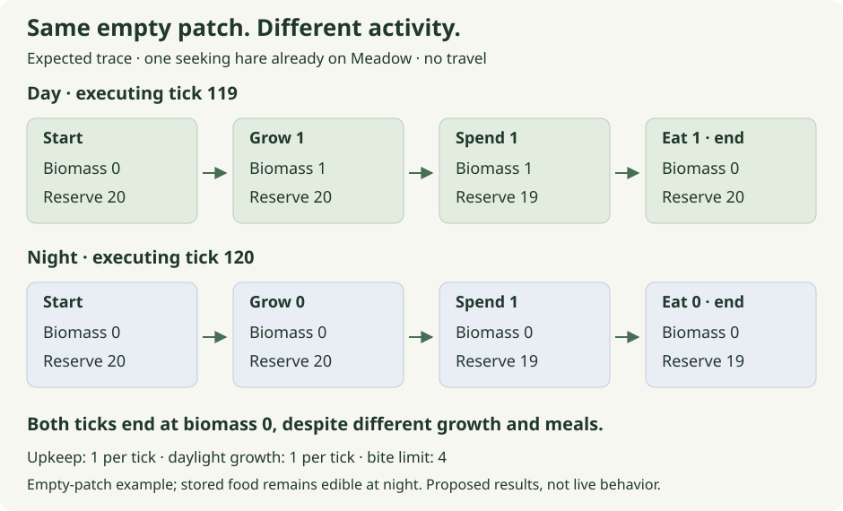

<p class="eyebrow">Chapter 5 · Production, stored food and simulation time</p>

# A world that feeds its inhabitants

A reliable meal eventually empties Meadow. Every unit Fern receives came from
a finite patch, so repeated visits cannot keep paying out forever. We now need
a source that adds biomass to the account. Once that source is visible, we
can give it a rhythm: Meadow produces during daylight, stores what remains,
and can supply that stored food during the night.

The familiar limit calculation will do much of the work. A meal asked how
much could fit in Fern's reserve; growth asks how much can fit in Meadow.
The new questions appear when the rules meet. Does growth happen early enough
for Fern to find and eat it this tick? Which tick first counts as night? Can
an empty-looking patch have produced a meal?

**The growth and environment rules in this chapter are proposed extensions.**
The edition's live browser has no regrowth or day/night cycle, and its
foraging loop remains future work. Each complete reference below is an
isolated worked model. Reading or running those references does not schedule
the rules in the live project.

## On this page

- [Bound Meadow’s growth](#give-meadow-room-to-recover)
- [Let new food become this tick’s meal](#new-food-can-become-this-ticks-meal)
- [Turn executed ticks into daylight](#convert-an-executing-tick-into-a-phase)
- [Let light control production](#let-light-choose-the-request)
- [Follow one empty patch through the night](#the-same-empty-patch-can-tell-two-different-stories)

## Give Meadow room to recover

Meadow represents a stand of grass at one simulation cell. Its biomass can
fall when eaten and rise when replenished without creating another patch or
changing its [footprint](07-another-kind-of-life.md#when-a-larger-picture-changes-contact).
Zero biomass will mean cropped grass that can regrow.
That is a selected modeling assumption: this first renewal rule does not
require seeds, neighboring plants or a separate recovery delay.

Use a proposed capacity of **100 biomass units** and, initially, constant-light
production of **1 biomass unit per tick**. We can inspect the capacity boundary
more clearly by asking for three units when Meadow already holds 99:

| Starting biomass and capacity | Requested addition, actual addition and resulting biomass |
| --- | --- |
| 99 of 100 | Request 3; retain 1; finish at 100. |
| 100 of 100 | Request 3; retain 0; finish at 100. |
| 95 of 100 | Request 3; retain 3; finish at 98. |

The request describes an attempted addition. The actual amount describes
what the patch retained. A function that leaves Meadow at 100 but reports
three units of growth in the first row would preserve the visible bound and
still corrupt the account. We want its return value to tell the same story
as its mutation.

The proposed helper takes `&mut FoodPatch`, just as the meal helper did.
It temporarily borrows the caller's patch and changes that patch's biomass.
It does not own a second copy of Meadow or need access to an entire ECS world
to calculate the permitted increase.

## The complete bounded-growth reference

This is the exact worked reference from
[session 09](../../../docs/tutorial/path/09-growing-grass.md). `FoodPatch`
already exists in Moss; the local `grow_biomass` function below is a proposed
helper with its own test. The future live checkpoint prepares that helper
and typed growth settings before asking for its biological rule.

**Reference check — expected: one named test.** Run from the repository root:

```sh
python3 docs/tutorial/authoring/check_path_examples.py --session 09
```

<!-- moss-example: session-09 -->
```rust
use moss_sim::FoodPatch;

fn grow_biomass(patch: &mut FoodPatch, capacity: u32, requested: u32) -> u32 {
    assert!(patch.biomass <= capacity, "biomass exceeds capacity");
    let actual = requested.min(capacity - patch.biomass);
    patch.biomass = patch.biomass.checked_add(actual).expect("biomass overflow");
    actual
}

#[test]
fn session_09_growth_reports_only_what_fits() {
    let mut meadow = FoodPatch {
        name: "Meadow",
        biomass: 99,
    };
    assert_eq!(grow_biomass(&mut meadow, 100, 3), 1);
    assert_eq!(meadow.biomass, 100);
    assert_eq!(grow_biomass(&mut meadow, 100, 3), 0);
    assert_eq!(meadow.biomass, 100);

    meadow.biomass = 95;
    assert_eq!(grow_biomass(&mut meadow, 100, 3), 3);
    assert_eq!(meadow.biomass, 98);

    meadow.biomass = 0;
    assert_eq!(grow_biomass(&mut meadow, 100, 1), 1);
    assert_eq!(meadow.biomass, 1);
    assert_eq!(grow_biomass(&mut meadow, 100, 0), 0);
    assert_eq!(meadow.biomass, 1);
}
```

The entry assertion gives the subtraction a valid starting point:
`patch.biomass` must not exceed `capacity`. Once that holds,
`capacity - patch.biomass` is the room available, and `requested.min(...)`
selects an amount no greater than that room. The same `actual` is added
and returned.

An already full patch is valid and produces zero. A patch starting above
capacity is invalid under this helper's contract and triggers the assertion.
Quietly reducing it to capacity would conceal a construction or settings
error. The agent must prepare consistent patch settings before the live
system calls this rule; the assertion does not replace validation of those
settings.

There is a reason this code uses ordinary subtraction for room while
maintenance uses `saturating_sub` for energy. Maintenance deliberately allows
an animal to have less reserve than its requested cost and stops the drain
at zero. Here the model requires starting biomass to fit its capacity. The
domain rule decides whether reaching a bound is an ordinary case or evidence
of invalid state.

The test resets biomass to 95, then to zero, to give different limits a turn.
The empty patch receives one unit, preserving our cropped-grass assumption.
A subsequent request of zero leaves that unit present. Zero production means
no new addition; it does not mean replace the stored biomass with zero. That
distinction will carry us through night without a second plant rule.

**This helper is a useful stopping point on its own.** It establishes how much
fits and what the function reports. It does not yet establish who receives
the new food, when they see it, or how much light this tick supplies.

## Read the stores and the changes separately

Meadow's biomass is a quantity present now. A growth rate describes a possible
addition per tick. A completed growth result is the amount actually added on
one execution. These numbers can share the value 1 while answering different
questions.

| Quantity | Meaning and unit |
| --- | --- |
| Meadow's biomass | Food currently stored in the patch, in biomass units. |
| Full-light growth rate | Requested production per executed daylight tick, in biomass units/tick. |
| Actual growth this tick | Addition retained after applying capacity, in biomass units. |
| Actual meal this tick | Biomass removed by an accepted transfer, in biomass units. |
| Fern's reserve | Energy currently stored in the animal, in energy units. |

In a **stock-and-flow** description, biomass and reserve are stocks: stored
quantities whose values accumulate the effects of earlier changes. Production
adds to one stock; a meal removes from it and supplies the other under an
explicit conversion. Upkeep and travel remove energy from the animal's reserve.
The words give names to the account we have already been keeping.

For Meadow, every term in the following equation is in biomass units:

```text
biomass after = biomass before + actual growth − actual biomass eaten
```

For Fern, the terms must be in energy units. The teaching conversion is one
energy unit gained per biomass unit eaten:

```text
reserve after = reserve before
              + actual biomass eaten × energy gained per biomass unit
              − maintenance actually deducted
              − travel energy actually charged
```

This is an account of outcomes. If upkeep requests two energy units while
Fern has one, saturating maintenance deducts one. Substituting the configured
two into the equation would invent a loss that did not occur. Travel has its
own acceptance rule: an unaffordable step moves no cells and charges nothing.
Each term comes from the rule's actual effect.

The 1:1 conversion makes the arithmetic convenient, but biomass and energy
retain different meanings. Adding their raw numbers can stand for a combined
energy-equivalent account only after stating that conversion. A later
conversion of two energy units per biomass unit would change the equation's
coefficient. It would not permit a test to add the two raw stores unchanged.

Open [MIT's stock-and-flow exercise](https://ocw.mit.edu/courses/15-871-introduction-to-system-dynamics-fall-2013/resources/mit15_871f13_ass3/)
when a rate, a reserve and a reported outcome begin to look like the same
number. Its opening sections ask what accumulates, what changes it and which
units each quantity carries. For Moss, the external source of new biomass
is deliberately simplified; this account is not a claim to model a closed
physical ecosystem, soil nutrients or photosynthesis in detail.

## New food can become this tick's meal

Put Fern on Meadow's cell with reserve 20, capacity 100 and a bite limit of
four. For the next comparison, set maintenance and travel costs to zero so
they cannot obscure what growth and eating do. Start Meadow empty.

Growth first creates one biomass. Eating then finds that one and transfers
it, leaving Fern at 21 and Meadow at zero. Eating first finds nothing;
growth afterward leaves Fern at 20 and Meadow at one. Each helper can obey
its own bounds in both orders. Their composition has different behavior.

The selected order is growth before feeding. It also needs to be **before
choice**. A patch replenished from zero must be observable as food when Fern
selects her target. For the first growth integration, the proposed tick is:

```text
growth → maintenance → choice → movement → eating → complete tick
```

To test that connection in the installed world, prepare Fern as Seeking with
**no `FoodTarget`**, already on the empty patch. Growth gives choice a new
opportunity; choice must supply the target that later permits a meal.
Expected end state: Meadow accepted as the target, reserve 21 and biomass 0.

The missing target is a consequential fixture choice. If we reused the
authored destination from the original diagnostic world, eating could find
Meadow after growth even when choice had run too early to observe it. The
energy and biomass assertions might pass while the causal connection we
intended to test remained broken.

In that setup without a target, a result of reserve 20 and biomass 1 points toward
a connection problem: choice may have seen the empty patch before growth,
or its new target may not have become visible before the action. The small
growth helper cannot diagnose either case by itself. The installed regression
must run the actual systems and exercise their communication.

### A full patch exposes a different ordering mistake

Now start Meadow at its full capacity of 100, keeping Fern at reserve 20.
Growth first retains zero because there is no room. A four-unit meal then
leaves biomass 96 and reserve 24. If eating ran first, it would make room;
the following growth would retain one and leave biomass 97.

| Starting biomass | The two orders give different accounts |
| --- | --- |
| 0 | Grow, then eat: reserve 21, biomass 0. Eat, then grow: reserve 20, biomass 1. |
| 100 | Grow, then eat: reserve 24, biomass 96. Eat, then grow: reserve 24, biomass 97. |

In the empty case, the animal's reserve reveals the order. In the full case,
the animal gets the same meal in either order; only the patch's remainder
distinguishes them. That makes a literal expectation of 96 more useful than
an assertion that merely checks the capacity was not exceeded.

## The complete composition reference

The exact [session 10 reference](../../../docs/tutorial/path/10-growth-meets-meals.md)
puts local growth and eating helpers next to each other. Read their two calls
as the order under investigation. This example does **not** run an ECS
schedule, perform target selection or establish meal eligibility. It begins
with a caller that has already arranged the interaction; the installed test
starting without a target supplies the broader evidence later.

**Reference check — expected: one named test.** Run from the repository root:

```sh
python3 docs/tutorial/authoring/check_path_examples.py --session 10
```

<!-- moss-example: session-10 -->
```rust
use moss_sim::{Energy, FoodPatch};

fn grow(patch: &mut FoodPatch, capacity: u32, rate: u32) -> u32 {
    assert!(patch.biomass <= capacity);
    let actual = rate.min(capacity - patch.biomass);
    patch.biomass = patch.biomass.checked_add(actual).expect("biomass overflow");
    actual
}

fn eat(energy: &mut Energy, patch: &mut FoodPatch, bite: u32) -> u32 {
    let actual = bite
        .min(patch.biomass)
        .min(energy.capacity.saturating_sub(energy.reserve));
    energy.reserve = energy.reserve.checked_add(actual).expect("energy overflow");
    patch.biomass -= actual;
    actual
}

#[test]
fn session_10_growth_then_food_preserves_the_account() {
    let mut fern = Energy {
        reserve: 20,
        capacity: 100,
    };
    let mut meadow = FoodPatch {
        name: "Meadow",
        biomass: 0,
    };
    assert_eq!(grow(&mut meadow, 100, 1), 1);
    assert_eq!(eat(&mut fern, &mut meadow, 4), 1);
    assert_eq!((fern.reserve, meadow.biomass), (21, 0));

    fern.reserve = 20;
    meadow.biomass = 100;
    assert_eq!(grow(&mut meadow, 100, 1), 0);
    assert_eq!(eat(&mut fern, &mut meadow, 4), 4);
    assert_eq!((fern.reserve, meadow.biomass), (24, 96));
    assert_eq!(fern.reserve + meadow.biomass, 120);
}
```

In the first case, `grow` returns 1 and `eat` returns 1. The patch ends where
it began, at zero, while the animal gains one. A final biomass of zero alone
cannot tell us that nothing happened. The two actual outcomes explain the
unchanged stock.

In the full-patch case, the final numeric sum is 120: reserve 24 plus biomass
96. Under this reference's explicit 1:1 conversion and zero costs, the meal
moves a finite amount between the stores, and growth retained nothing.
That is why the sum matches the starting 20 plus 100. It is not a general
equation for a normal tick with upkeep, travel or another conversion.

This composition leaves capacity and transfer rules intact. We can now change
the amount requested from the environment without changing either rule.
The next question is what should make that input change.

## A day advances when the world advances

Moss already has a distinction between time passing outside the application
and ticks executing inside it. Pressing Step requests one complete simulation
tick. During Play, a rendered frame can request no ticks, one tick or several.
The maintenance rule charges executed ticks; drawing another picture does not
spend energy.

Daylight should use that same simulation clock. If Fern remained paused while
the computer's clock moved the world from night into day, the environment and
the animal would have experienced different amounts of time. We would need
another policy for missed production and costs. Deriving light from executed
ticks keeps their progress together. Pausing also pauses the day; hidden-tab
suspension does not create catch-up biology.

The [tick walkthrough](../../../docs/tutorial/context/a-tick-through-moss.md#the-browser-requests-a-tick)
explains the existing browser-to-simulation route. Equal time waiting at the
computer is not a guarantee of equal ticks, especially when playback is
paused or delayed. The comparison that matters here holds the executed ticks
and accepted inputs constant.

Open Glenn Fiedler's [Fix Your Timestep!](https://gafferongames.com/post/fix_your_timestep/)
when you want a fuller account of how rendering and simulation can advance
at different rates. Its fixed-step explanation is useful background; its
physics examples do not choose Moss's hidden-tab policy or biology.

For a visible demonstration, use **240 phase values**: phases 0–119 are day,
and 120–239 are night. At a sustained four simulation ticks per second,
240 ticks take one minute of wall time. That is a convenient viewing cycle,
not a calibration of hare metabolism. Pauses and delayed playback can make
the same number of ticks take longer to watch.

## Convert an executing tick into a phase

The completed-tick counter grows with the run. The remainder operator `%`
turns that growing sequence into a repeating phase:

```text
phase = executing tick % 240
daylight = phase < 120
```

Tick 239 has phase 239 and is night. Tick 240 has phase 0 and is day again.
The first calculation wraps time; the second interprets the resulting phase.
Keeping those two jobs visible makes the boundary easier to reason about.

There is one more choice hidden in the word “tick.” Before a Step, the world
stores how many ticks have **completed**. The environmental input for the
tick about to run is computed from `completed + 1`, using checked arithmetic.
Then growth and the creatures use that tick's light. Completion finally
advances the stored counter.

| Completed count before the Step | Executing tick and the light supplied to growth |
| --- | --- |
| 0 | Execute tick 1; phase 1; day. |
| 118 | Execute tick 119; phase 119; day. |
| 119 | Execute tick 120; phase 120; night. |
| 238 | Execute tick 239; phase 239; night. |
| 239 | Execute tick 240; phase 0; day. |

If the world has completed 119 ticks, using 119 again would give the next
growth call yesterday's classification. This convention instead computes
night for the executing tick 120 before its growth phase. After completion,
the inspector should report tick 120 and night together.

### Tick zero describes initialization

At reset, phase 0 is daylight. That initialized state does **not** perform a
growth update before the first requested Step. The first growth opportunity
belongs to executing tick 1.

That makes the initial daylight interval contain **119 updates**, ticks
1–119. Night occupies ticks 120–239. The next daylight interval, ticks
240–359, contains the full **120 updates**, including its phase-0 dawn.
There is no missing execution at reset: tick 0 is a state label, not a Step
that was secretly run.

| Interval | Executing ticks and daylight growth opportunities |
| --- | --- |
| Initial daylight before first dusk | Ticks 1–119; 119 opportunities. |
| First night | Ticks 120–239; 0 opportunities. |
| Following daylight | Ticks 240–359; 120 opportunities. |

“The first daylight interval has 119 updates” does not mean every block of
240 executed ticks has one fewer daylight tick. Steps 1–240 include the first
update of the next dawn: 119 daylight updates before dusk plus tick 240,
making 120. The short initial interval comes from where the run begins within
the labeling convention.

These are opportunities to request production, not a guarantee of biomass
retained. Starting Meadow at 80 with capacity 100 and no eater, one-unit
requests during the first 119 daylight updates can add only **20** actual
biomass. Meadow reaches capacity; the remaining requests retain zero.
Multiplying a configured rate by daylight ticks would overstate production.

## The complete daylight reference

The exact [session 11 reference](../../../docs/tutorial/path/11-a-day-from-ticks.md)
isolates the classification. Its fixed period is nonzero. A future configurable
period would need validation and a defined split between day and night; the
current function has one concrete convention to test.

**Reference check — expected: one named test.** Run from the repository root:

```sh
python3 docs/tutorial/authoring/check_path_examples.py --session 11
```

<!-- moss-example: session-11 -->
```rust
const TICKS_PER_DAY: u64 = 240;

fn is_daylight(tick: u64) -> bool {
    tick % TICKS_PER_DAY < TICKS_PER_DAY / 2
}

#[test]
fn session_11_daylight_changes_at_exact_tick_boundaries() {
    assert!(is_daylight(0));
    assert!(is_daylight(119));
    assert!(!is_daylight(120));
    assert!(!is_daylight(239));
    assert!(is_daylight(240));
    assert!(is_daylight(359));
    assert!(!is_daylight(360));

    let completed_tick = 119_u64;
    let executing_tick = completed_tick.checked_add(1).expect("tick overflow");
    assert_eq!(executing_tick, 120);
    assert!(!is_daylight(executing_tick));
    assert!(is_daylight(completed_tick));

    assert_eq!((1..120).filter(|tick| is_daylight(*tick)).count(), 119);
    assert_eq!((240..360).filter(|tick| is_daylight(*tick)).count(), 120);
}
```

`is_daylight` needs no mutable reference because it changes nothing. It maps
one tick number to a `bool`. The environment system will supply the executing
tick, store the classification, and make that result available to growth and
inspection. A test of this function cannot establish that the system passes
the right tick number.

The paired assertions at 119/120 and 239/240 protect the exact transitions.
Using `<=` instead of `<` would extend daylight into phase 120. The next
comparison makes the input convention explicit: completed 119 is day, while
executing 120 is night. Both answers can be correct for their respective
inputs; the adapter has to choose the one belonging to the work about to run.

The final two ranges in the test are half-open. `1..120` includes 1 and stops
before 120; `240..360` includes 240 and stops before 360. The iterator's
`filter` retains the ticks classified as daylight, and `count` counts them.
The closure receives a reference to each tick, so `*tick` copies its number
into `is_daylight`. These assertions keep the 119/120 distinction in executable
form instead of relying on a caption alone.

## Let light choose the request

The new environmental connection is small: during day, request the configured
full-light rate; during night, request zero. The capacity helper still decides
what Meadow can retain. Darkness does not need a separate subtraction or an
alternative patch type.

This gives the proposed complete order for this chapter:

```text
environment → growth → maintenance → choice → movement → eating → complete tick
```

The environment classifies the executing tick before growth requests its
addition. Growth happens before choice can select a newly edible patch.
The end-of-tick inspector reads the committed result. A renderer may tint the
world from the same environment value; the color of a background must not
become the input that decides whether biomass appears.

**Night stops new light-driven production, not consumption of stored food.**
If Meadow already holds four biomass, a night request of zero leaves those
four available. Fern can still eat them when the ordinary activity, target,
contact and capacity requirements allow a meal. Assigning the request directly
to `patch.biomass` would erase the stock and confuse a flow with its store.

Before involving a whole population, inspect a narrow boundary case. Start
Meadow at 98 and make the following production calls, without any meals:

| Executing tick supplied and light | Requested growth, actual growth and resulting biomass |
| --- | --- |
| 119: day | Request 1; retain 1; biomass becomes 99. |
| 120: night | Request 0; retain 0; biomass stays 99. |
| 239: night | Request 0; retain 0; biomass stays 99. |
| 240: day | Request 1; retain 1; biomass becomes 100. |

This short sequence deliberately samples the boundaries. It does not run the
intervening simulation ticks or let animals act between them. It answers a
focused question: given each of these tick labels, does the production helper
preserve existing food and add only what light and capacity permit?

## The complete light-to-growth reference

This is the exact local model from
[session 12](../../../docs/tutorial/path/12-light-controls-growth.md).
`requested_growth` supplies the new conditional. `produce_for_tick` repeats
the earlier classification and capacity arithmetic so this block can run on
its own; it is not another live implementation to maintain. Likewise,
`eat_stored_food` starts after interaction eligibility has been established.
There is no ECS schedule, maintenance, movement or choice inside this test.

**Reading excerpt — `requested_growth` from the complete isolated reference below.**
The imports, local types and test fixtures remain in the expandable answer.

```rust
fn requested_growth(daylight: bool, full_light_rate: u32) -> u32 {
    if daylight { full_light_rate } else { 0 }
}
```

**Reference check — expected: one named test.** Run from the repository root:

```sh
python3 docs/tutorial/authoring/check_path_examples.py --session 12
```

<details class="worked-reference">
<summary>Complete light-to-growth answer and test (61 lines)</summary>

<!-- moss-example: session-12 -->
```rust
use moss_sim::{Energy, FoodPatch};

fn requested_growth(daylight: bool, full_light_rate: u32) -> u32 {
    if daylight { full_light_rate } else { 0 }
}

fn produce_for_tick(patch: &mut FoodPatch, executing_tick: u64) -> u32 {
    let daylight = executing_tick % 240 < 120;
    let requested = requested_growth(daylight, 1);
    assert!(patch.biomass <= 100);
    let actual = requested.min(100 - patch.biomass);
    patch.biomass = patch.biomass.checked_add(actual).expect("biomass overflow");
    actual
}

fn eat_stored_food(energy: &mut Energy, patch: &mut FoodPatch) -> u32 {
    let eaten = 4_u32
        .min(patch.biomass)
        .min(energy.capacity.saturating_sub(energy.reserve));
    patch.biomass -= eaten;
    energy.reserve = energy.reserve.checked_add(eaten).expect("energy overflow");
    eaten
}

#[test]
fn session_12_light_changes_production_without_erasing_food() {
    assert_eq!(requested_growth(true, 3), 3);
    assert_eq!(requested_growth(false, 3), 0);
    assert_eq!(requested_growth(true, 0), 0);

    let mut meadow = FoodPatch {
        name: "Meadow",
        biomass: 98,
    };
    assert_eq!(produce_for_tick(&mut meadow, 119), 1);
    assert_eq!(meadow.biomass, 99);
    assert_eq!(produce_for_tick(&mut meadow, 120), 0);
    assert_eq!(produce_for_tick(&mut meadow, 239), 0);
    assert_eq!(meadow.biomass, 99);
    assert_eq!(produce_for_tick(&mut meadow, 240), 1);
    assert_eq!(meadow.biomass, 100);

    let mut fern = Energy {
        reserve: 20,
        capacity: 100,
    };
    let eaten = eat_stored_food(&mut fern, &mut meadow);
    assert_eq!((eaten, fern.reserve, meadow.biomass), (4, 24, 96));

    assert_eq!(produce_for_tick(&mut meadow, 241), 1);
    assert_eq!(meadow.biomass, 97);

    let mut night_food = FoodPatch {
        name: "night stock",
        biomass: 4,
    };
    fern.reserve = 20;
    assert_eq!(produce_for_tick(&mut night_food, 120), 0);
    assert_eq!(eat_stored_food(&mut fern, &mut night_food), 4);
    assert_eq!((fern.reserve, night_food.biomass), (24, 0));
}
```

</details>

The first three assertions test the request independently of Meadow. Daylight
passes through a configured rate of three, night requests zero, and a
configured zero remains zero even during day. They prevent a helper from
hard-coding the usual rate of one or inventing production when the configured
source is disabled.

The next assertions follow the 98-to-100 boundary table. Once Meadow reaches
100, the reference gives Fern a four-unit meal: reserve becomes 24 and
biomass becomes 96. The tick-241 production call then has room for one,
leaving 97. The sequence connects a capacity decision to the previous action
that made room; it does not imply those local calls exercised the installed
tick order.

Finally, a separate patch named `night stock` begins with four biomass at
executing tick 120. Production adds zero, and a meal still transfers four.
Fern ends at 24 and that patch at zero. This checks a different connection
from preserving Meadow's 99: light controls production, while existing
biomass remains available to the transfer rule.

The environment can later supply another effective-light value without
changing what a meal means. A future fractional request would need its own
rounding or remainder policy; repeatedly truncating a small positive amount
to zero could prevent it from ever accumulating. Binary daylight keeps that
new question outside this first connection.

## The same empty patch can tell two different stories

Now return to one continuous proposed run. Place Fern on an empty Meadow at
**completed tick 118**, Seeking with reserve **20** and capacity **100**.
Use one biomass unit of daylight growth per tick, one energy unit of requested
maintenance and a four-unit bite limit. There are no other eaters, no travel
cost and no death rule in this observation. Choice can select the same-cell
patch when growth makes it nonempty.

At executing tick 119, one biomass grows. Maintenance deducts one energy,
leaving Fern at 19. Choice sees the new food, and the permitted meal transfers
one. Fern finishes at 20 while Meadow returns to zero. Both growth and feeding
happened even though neither final store differs from the start.

At tick 120, night requests no growth. Maintenance deducts one, leaving Fern
at 19. Meadow has neither new nor stored biomass, so there is no eligible food
target and no meal. The patch again ends at zero, this time because there was
nothing to transfer.



[Open the stores and changes diagram at full size](../../../docs/tutorial/path/visuals/stock-and-flow.svg).

Compare actual growth and meals as well as the final stores. The figure
compresses away choice, unchanged position and tick completion to show the
quantities that change. Its night row starts with an empty patch; it does
not mean darkness would forbid a meal from stored food. These are predicted
results for the proposed rules, not observations from the live browser.

### Follow Meadow through the night to dawn

Keep the same setup through the remaining night. Meadow stays empty because
growth requests zero, and no other source adds food. Fern loses one energy per
night tick while she has energy to lose. Tick 139 is the twentieth night tick,
so its maintenance brings her reserve from one to zero.

The assumption that nothing dies now matters. Later night ticks leave Fern present
with zero reserve; saturating upkeep deducts zero. This chapter has not yet
defined a terminal consequence for that state. At the next dawn, tick 240,
Meadow grows one biomass before choice. Fern is already on its cell, so no
paid movement is required. Maintenance requests one but deducts zero from
her empty reserve. The one-unit meal then leaves reserve one and biomass zero.

| After executing tick and its light | Stores and the exchange that explains them |
| --- | --- |
| 119: day | Fern reserve 20; Meadow biomass 0. One grows and is eaten; upkeep deducts one. |
| 120: night | Fern reserve 19; Meadow biomass 0. No food arrives; upkeep deducts one. |
| 139: night | Fern reserve 0; Meadow biomass 0. The twentieth night deduction exhausts the reserve. |
| 239: night | Fern reserve 0; Meadow biomass 0. Later upkeep has no reserve left to deduct. |
| 240: day | Fern reserve 1; Meadow biomass 0. A new unit grows and is eaten; upkeep actually deducts zero. |

Across night ticks 120–239, maintenance **requests 120 energy units** but
actually deducts **20**. It creates no unpaid debt in this model. The reserve
account is `20 + 0 − 20 = 0`, not a negative reserve or an invented payment
of 120. At dawn the account is `0 + 1 − 0 = 1`. That distinction follows from
the existing saturation rule and remains relevant when we choose what zero
should mean.

Meadow's account is equally specific. Across ticks 119–240 in this example,
it begins empty, retains two units of actual growth—one at 119 and one at
240—and supplies two units of meals. It ends empty: `0 + 2 − 2 = 0` biomass.
A picture of the patch at either end would conceal both transfers. Reporting
actual outcomes lets the inspector explain the intervening life.

### Explore the boundary one complete tick at a time

The independent lab starts with the dusk case above. Step twice and compare
tick 119's one-unit growth and meal with tick 120's empty night. Then choose
the stored-food preset: night still requests no growth, but its four biomass
can feed Fern. The full-patch preset exposes another limit: daylight requests
one unit of growth, yet a full patch retains zero before the meal makes room.

Changing the preset starts a fresh example. **Step to next boundary** executes
every intervening tick, at most 120, rather than skipping production or upkeep.
Its summary reports totals across that action; the outcome cards describe only
the last tick. The static traces above contain the complete explanation without
using the controls.

<section class="lab" data-lab="daylight" aria-label="Daylight, stored food and actual transfers">
<div class="lab-heading"><span class="lab-kind">Independent teaching model</span><strong>Light changes production, not stored food</strong></div>
<p>This JavaScript illustration does not execute Rust or the live simulation. Fern is an eligible grazer on Meadow throughout; contact is assumed. It runs environment → growth → maintenance → same-cell meal → completion. There is no choice, travel or death policy: Fern remains present at zero.</p>
<p>Both capacities are 100. Daylight phases 0–119 of a 240-tick cycle request 1 biomass per tick; night requests 0. Maintenance requests 1 energy per tick. A meal transfers at most 4 biomass at 1 energy per biomass, bounded by available food and reserve capacity.</p>
<div class="lab-controls">
<label>Authored starting state <select data-input="preset" disabled><option value="dusk">Before dusk: completed 118, reserve 20, biomass 0</option><option value="nightFood">Stored night food: completed 119, reserve 20, biomass 4</option><option value="dawn">Before dawn: completed 238, reserve 0, biomass 0</option><option value="fullPatch">Full daylight patch: completed 118, reserve 100, biomass 100</option></select></label>
</div>
<p data-output="start">Selected starting state: completed tick 118; Fern reserve 20 of 100 energy units; Meadow biomass 0 of 100. Reset restores the selected starting state without executing a tick.</p>
<div class="lab-state" data-output="state"></div>
<div class="lab-state" data-output="outcomes"></div>
<div class="lab-actions"><button type="button" data-action="step" disabled>Step one tick</button><button type="button" data-action="boundary" disabled>Step to next boundary (2 ticks)</button><button type="button" data-action="reset" disabled>Reset selected preset</button></div>
<p class="lab-explanation" data-output="explanation" role="status" aria-live="polite" aria-atomic="true">Enable JavaScript to inspect each exchange. In the default static trace, tick 119 grows and transfers 1, leaving reserve 20 and biomass 0; tick 120 grows and transfers 0, leaving reserve 19 and biomass 0. No interactive tick has executed.</p>
</section>

## Check one connection at a time

Each complete reference has an adjacent command that runs its local test in
a temporary workspace. Expect one named test per selected reference. The
[reference verification](../../../docs/tutorial/path/verification.md)
separates these checks from later installed behavior. The blocks in this
chapter are exact copies; these commands extract the canonical guide blocks.
They neither test an unfinished live helper nor activate its system.

| Reference | What its assertions establish |
| --- | --- |
| [09: bounded growth](#the-complete-bounded-growth-reference) | Growth respects capacity and reports the retained amount. |
| [10: growth and meals](#the-complete-composition-reference) | The stated local order produces the literal empty/full-patch accounts. |
| [11: daylight](#the-complete-daylight-reference) | Tick classification and the initialization convention have exact boundaries. |
| [12: light and growth](#the-complete-light-to-growth-reference) | Light controls requests, capacity bounds production, and night preserves edible stock. |

When a checkpoint becomes active, the agent prepares its live helper or
installed regression and supplies the exact command. Growth must be observed
by choice, the environment must receive the executing tick, and inspection
must show actual outcomes. Those claims require the real data flow in
addition to correct local functions.

The later browser review can start at completed tick 118 to inspect dusk
without waiting through an entire day. Pause should hold the phase and stores
still; a Step should execute one full exchange. Repeat with stored food at
night to show that the absence of production does not disable eating. A scene
tint can make dusk easier to spot, while the simulation values explain what
happened. Native assertions, a WASM build and those browser observations
remain distinct evidence.

Meadow now has a source as well as a drain in the proposed world. Whether food
accumulates depends on when production fits and what the animals consume;
daylight alone does not promise a full patch or a sustainable population.
Fern's empty reserve before dawn leaves the next question close at hand:
should the world keep her present until food returns, or should reaching zero
have a consequence at a precisely defined point in the tick?
