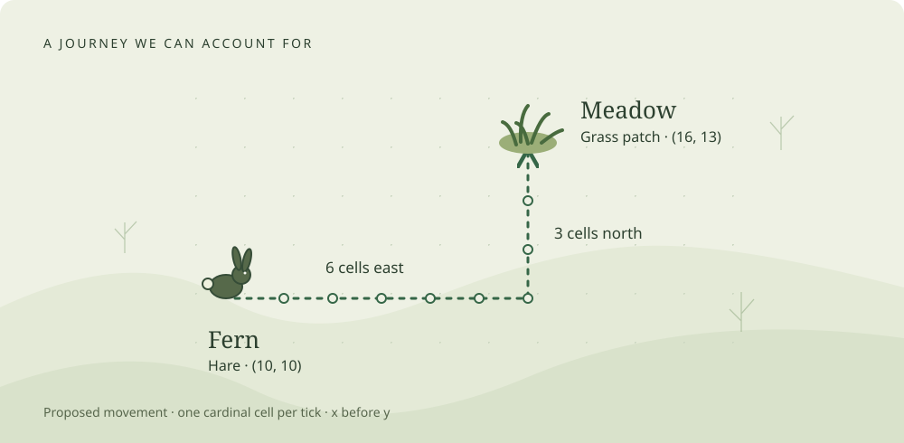

Moss · The textbook edition · September 2026

# A small world, understood

Build a little life. Follow every consequence.

Fern is a hare. Meadow is a patch of grass. They are nine cells apart, and a
short journey between them gives us a surprisingly good place to learn Rust.
There is a value to copy, a pair of values to borrow, a decision to make before
changing either, and a test that can tell whether we got the decision right.

**[Start with one affordable step →](chapters/01-one-affordable-step.md#your-first-edit)**

New to the repository? [Get this edition's starter running](reference/start-here.md)
first. It includes the exact unfinished exercise and its tests.

[Open the journey diagram at full size](assets/first-journey.svg).

*One proposed journey. Six cells east, then three north. A small rule can explain
the whole route, including why it might stop early.*

Moss is an ecosystem to build and a program to understand. A creature should
eventually find food, spend resources, encounter other creatures and leave a
history we can inspect. Those ambitions become useful when we can follow one
small action all the way through. This book begins there and grows the model
only when its inhabitants give us another problem worth solving.

## A book beside the workbench

This edition is for someone who knows how to program and wants to regain fluency
while learning Rust and an entity-component-system architecture. The chapters
introduce a language feature when an actual decision needs it. You will meet
mutable references while committing a step, `Option` while looking for food,
and query filters while deciding which entities a system can reach.

Read at either of two speeds. You can follow the main argument and its pictures
without opening an editor. Chapter 1 also gives you a ready-to-edit function
and a test of your change. Later chapters let you explore and run complete
reference examples; their live exercises are prepared one at a time during
paired work. A reference command checks the printed answer, rather than your
saved implementation, and does not install that behavior in the world.

Complete worked answers remain available throughout. Read and trace as much of
an answer as helps you regain your bearings; the nearby variation gives you a
chance to use the idea yourself.

The browser edition includes interactive teaching models. Every model has a
static trace beside it so the chapter also makes sense in RustRover or print.
The diagrams and labs explain a rule; they are not recordings of the Moss app.

## The world at this edition's starting line

The September 23, 2026 checkpoint has a working browser, an inspectable ECS world,
and an implemented maintenance rule. Each executed tick spends an animal's
configured upkeep. Animals remain alive when their energy reaches zero.

Movement's components, target, adapter and tests are prepared. Its small rule,
`move_one_cell`, still contains `todo!()`, and the adapter is not scheduled.
That function is the first contribution. The later meals, choice, individual
costs, growth and lifecycle rules in this book are worked proposals, not claims
about what is already installed.

The local repository's `NOW.md` remains the live handoff when the project moves
past this edition. Its existing guides stay available. This book offers another
way to understand the same work, with more room for experiments and explanations.

## Six questions to grow a world

The reading path follows consequences rather than a catalog of syntax:

1. **Can Fern afford this step?** Copy a proposal, validate it, then commit the
   position and energy together.
2. **Who gets the last bite?** Bound a meal by supply and capacity, then resolve
   two animals competing for the same food.
3. **Who chose Meadow?** Turn a fixture's instruction into a bounded observation
   and a remembered activity.
4. **What makes two hares different?** Resolve defaults into owned values and
   design a comparison that tells us what those differences caused.
5. **Where does new food enter?** Account for growth, daylight and stored biomass
   in a world whose time advances by executed ticks.
6. **What happened to this animal?** Define a lifecycle boundary, retain an honest
   outcome, and distinguish an implementation error from a harsh environment.

These six chapters form the main path. A final coda considers predators, rest,
offspring and inheritance without making them prerequisites for the first edit.
The [edition notes](reference/edition-notes.md) distinguish tested examples from
behaviors still to be integrated into the living world.

## Names that will stay with us

Fern and Flint are individual nicknames. Their species are Hare and Fox. Their
ecological roles are Grazer and Hunter. Meadow is the nickname of one Grass
patch, whose role is Producer. A second hare can share Fern's species without
sharing her identity or current energy.

An ECS **archetype** means something else: a group of entities with the same set
of component types. It describes storage membership, not an animal's species
or personality. We will use these words consistently because each answers a
different question about the world.

This book's first journey needs only Fern, her destination and one affordable
step. [Open that function with us.](chapters/01-one-affordable-step.md)
