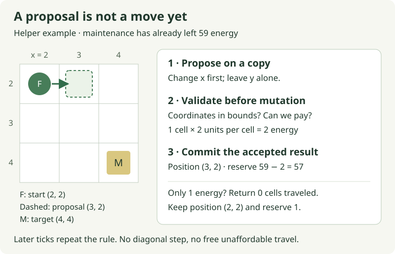

# 4. Pay for the distance actually traveled

[Guide home](README.md) · Session: [today](today.md) · Next after review: [eating](05-eating.md)

**Ready: implement `move_one_cell`; movement remains unscheduled until review.**
The helper stub and focused test are prepared. The test is intentionally red;
the browser still runs maintenance alone. See
[the verification record](authoring/verification.md) for executed checks and limits.

Fern has an authored target: Meadow. This gives us a destination without first
building an autonomous food policy. Today's edit takes one affordable step toward
that destination and pays for the distance actually traveled. Later, food choice
can assign a different target without changing this step rule.

**Start here:** in [`lessons.rs`](../../crates/moss-sim/src/lessons.rs), replace
only the body of `move_one_cell`. Its prepared imports and signature already
match this chapter. Run checkpoint A's test, then stop for review; the agent
handles schedule activation and browser verification.

## On this page

- [Where costs belong](#where-costs-belong)
- [A: an affordable step](#checkpoint-a--an-affordable-step)
- [B: move toward the accepted target](#checkpoint-b--move-toward-the-accepted-target)
- [Optional: a journey that ends where it started](#optional-a-journey-that-ends-where-it-started)

## Where costs belong

Maintenance charges for an executed tick. Movement charges for an accepted
change of position. The prepared `MovementRules` resource supplies a rate of
**2 energy units per cell**. Keeping these units separate makes the two causes
visible without first redesigning every species setting.



Read the diagram as **propose → validate → commit**. With reserve 60, maintenance
first leaves 59. A one-cell move then costs 2, leaving 57. If maintenance leaves
only 1, movement must preserve both the cell and that remaining energy. Saturating
subtraction would incorrectly let the animal take a step it could not afford.

The first route moves at most one cardinal cell per tick, along x before y,
without obstacles or collision. For Fern's route from `(10, 10)` to `(16, 13)`,
that is six x steps and three y steps. The sprite's size is not distance and does
not determine contact; the simulation uses integer cells.

## Checkpoint A — an affordable step

The helper takes mutable position and energy references, a target position,
a travel rate and validated world dimensions. It returns the distance accepted:
zero or one cell. It is an ordinary Rust function with no ECS query inside it.
That lets the first test name all inputs without constructing an entire world.

The following shows the **first cases of the prepared test** in
[`tests/movement.rs`](../../crates/moss-sim/tests/movement.rs); it is already in
the project, so you do not need to paste it. The full test also covers both axes,
both directions, exact affordability and world edges. The `use` line brings its types and
helper into this test file's scope.

<!-- example: movement-test -->
```rust
use moss_sim::{Energy, Position, WorldConfig, lessons::move_one_cell};

#[test]
fn movement_charges_only_an_affordable_actual_step() {
    let mut position = Position { x: 2, y: 2 };
    let mut energy = Energy { reserve: 59, capacity: 100 };
    let target = Position { x: 4, y: 4 };
    let config = WorldConfig::default();

    // Maintenance has already reduced 60 to 59 for this helper example.
    assert_eq!(move_one_cell(&mut position, &mut energy, target, 2, config), 1);
    assert_eq!(position, Position { x: 3, y: 2 }); // x first, no diagonal.
    assert_eq!(energy.reserve, 57);

    energy.reserve = 1;
    assert_eq!(move_one_cell(&mut position, &mut energy, target, 2, config), 0);
    assert_eq!(position, Position { x: 3, y: 2 });
    assert_eq!(energy.reserve, 1);

    energy.reserve = 10;
    let current = position;
    assert_eq!(move_one_cell(&mut position, &mut energy, current, 2, config), 0);
    let outside = Position { x: -1, y: 2 };
    assert_eq!(move_one_cell(&mut position, &mut energy, outside, 2, config), 0);
    assert_eq!(position, current);
    assert_eq!(energy.reserve, 10);
}
```

**Run from the repository root:**

```sh
scripts/with-toolchain.sh cargo test -p moss-sim --locked --test movement movement_charges_only_an_affordable_actual_step -- --exact
```

**Expected before the edit:** exactly one test fails at the unfinished helper.
**Expected after the edit:** `1 passed; 0 failed`. The first assertions require a
paid x step; the later ones require no changes for an unaffordable move, arrival
and an out-of-bounds target. A correct return value alone would not establish
that position and energy were updated correctly.

Start your body with a tentative destination. These are **excerpts for reasoning**,
not a second function to paste:

```rust
let mut next = *position;
// Compute a proposed next cell, then its cost.
// Return 0 if the move is invalid or unaffordable.
// Only after those checks, update position and energy together.
```

`position` is a mutable reference, written `&mut Position` in the signature.
It borrows the caller's value exclusively for this call. `*position` accesses
that value; because `Position` implements `Copy`, assigning it to `next` makes a
small independent copy. Changing `next` does not move the real animal yet.
This lets us validate a proposal without having to undo mutations on failure.

Rust's `if` can also produce a value. In the worked answer, the expression
`if next.x < target.x { 1 } else { -1 }` supplies the direction for one x step.
The following `else if` means y changes only after x is already aligned. There
is no loop inside this helper: the ECS adapter calls it for eligible animals,
and subsequent ticks call it again for subsequent steps.

**Complete worked replacement** for `move_one_cell` in `lessons.rs`, using its
prepared `Energy`, `Position` and `WorldConfig` imports. Keep this answer available
while you work; comparing or copying it is fine.

<!-- example: movement-helper -->
```rust
pub fn move_one_cell(
    position: &mut Position,
    energy: &mut Energy,
    target: Position,
    units_per_cell: u32,
    config: WorldConfig,
) -> u32 {
    let in_bounds = |p: Position| {
        (0..config.width() as i32).contains(&p.x)
            && (0..config.height() as i32).contains(&p.y)
    };
    if !in_bounds(*position) || !in_bounds(target) {
        return 0;
    }

    let mut next = *position;
    if next.x != target.x {
        next.x += if next.x < target.x { 1 } else { -1 };
    } else if next.y != target.y {
        next.y += if next.y < target.y { 1 } else { -1 };
    }

    let distance = position.x.abs_diff(next.x)
        .checked_add(position.y.abs_diff(next.y))
        .expect("step distance overflow");
    let cost = distance.checked_mul(units_per_cell)
        .expect("movement cost overflow");
    if energy.reserve < cost {
        return 0;
    }

    *position = next;
    energy.reserve -= cost;
    distance
}
```

The `in_bounds` closure is a small local function that checks both coordinates.
The ranges exclude their upper bound: width 32 permits x values 0 through 31.
`WorldConfig` limits dimensions to 8–256, so these casts to `i32` fit. Taking a
step toward an in-bounds target from an in-bounds cell keeps the step in bounds.

`abs_diff` returns the unsigned distance on one axis. Adding the two axes gives
cell travel distance for this cardinal step. The checked arithmetic reports
an overflow rather than silently changing the cost. Once affordability passes,
`*position = next` writes the proposal back through the borrow, and subtracting
the cost is safe. The final `distance` has no semicolon because it is the
function's returned value.

**If the result differs:** check when you write `*position`. Moving before the
affordability check makes the low-energy assertion fail even if energy is correct.
If zero tests run, check the exact test target and filter; that is not green.
A compiler error at the stub is a setup issue rather than the intended red test.

**Observed evidence:** the live helper remains Nick's edit. Isolated worked-answer
checks and their exact commands are recorded in
[verification](authoring/verification.md); they do not establish live browser
movement. The installed checkpoint below still needs review and activation.

**Send for review:**

> The Chapter 4 step test is green. Review bounds, affordability and the mutation
> order. Activate the prepared movement system and run its integration and browser
> checks. Keep eating for the next paired edit.

## Checkpoint B — move toward the accepted target

This is the agent's integration work after your helper passes review. You do not
need to implement another body before seeing motion. The prepared `move_to_food`
adapter resolves the animal's `FoodTarget` stable ID to a current, nonempty food
patch (Meadow is grass), obtains the components, and calls your helper. It remains
unscheduled while that helper is unfinished.

A **query** supplies a system with components from matching entities. The adapter
borrows an animal's `Position` and `Energy` mutably, because your helper changes
them. It reads the target patch's position. The native helper and the ECS adapter
have distinct responsibilities: the helper decides a step; the adapter finds
which values that decision applies to.

Food queries explicitly exclude creatures so those position borrows are disjoint.
A stable target ID also needs resolving each tick: the fact that Meadow existed
when the target was authored does not prove it still exists now. Missing or empty
food means no travel and no travel charge. Flint has no authored food target and
continues paying only maintenance.

After review the agent installs maintenance → movement → complete tick, enables
both prepared integration regressions (currently explicitly ignored), and runs:

```sh
scripts/with-toolchain.sh cargo test -p moss-sim --locked --test movement
```

**Expected after activation:** all three movement tests run and pass, with none
ignored. They exercise the helper, installed world, Reset, and missing, empty or
unaffordable destinations. The agent also checks the
helper's remaining boundaries, including y movement, both directions, exact
affordability and world edges. The first helper example is not exhaustive coverage.
Maintenance tests use no-food setup so their existing reserve assertions keep
measuring maintenance alone; their expected values are preserved.

The browser acceptance path is **Reset → inspect Fern → Step**, then continue
stepping. All numbers below are expected after reviewed activation:

| Executed ticks since Reset | What the inspector should show |
| --- | --- |
| 0 | Fern `(10, 10)`, reserve 60; Flint reserve 60; Meadow biomass 80. |
| 1 | Fern `(11, 10)`, reserve 57; Flint reserve 59. |
| 9 | Fern `(16, 13)`, reserve 33; Flint reserve 51; Meadow biomass 80. |
| 10 | Fern still `(16, 13)`, reserve 32; Flint reserve 50; Meadow biomass 80. |

The route is nine cells: `60 − 9 × 1 − 9 × 2 = 33`. Once Fern arrives,
maintenance continues but travel distance becomes zero. Pause, pan and zoom must
leave position and reserve unchanged. Reset restores the same starting state and
target; eating remains inactive and zero-energy animals remain alive.

Stop when the reviewed helper, installed test and browser agree. That is a
complete visible contribution. If there is time, the next edit is
[a bounded meal](05-eating.md), prepared separately by the agent.

## Optional: a journey that ends where it started

Suppose a later action moves from `(2, 2)` to `(3, 2)`, then back to `(2, 2)`.
Its final displacement is zero, but its traveled distance is two cells. At 2 units
per cell, travel should cost 4 before counting maintenance. A future multi-segment
action must sum accepted segment lengths; comparing only its endpoints would
lose that cost.

For the current one-cell action, old and new positions are enough. No persistent
distance component is required. The [tick walkthrough](context/a-tick-through-moss.md)
shows how the simulation's result becomes a visible position without letting
render frame rate decide how far an animal travels.

[Guide home](README.md) · Session: [today](today.md) · Next after review: [eating](05-eating.md)
