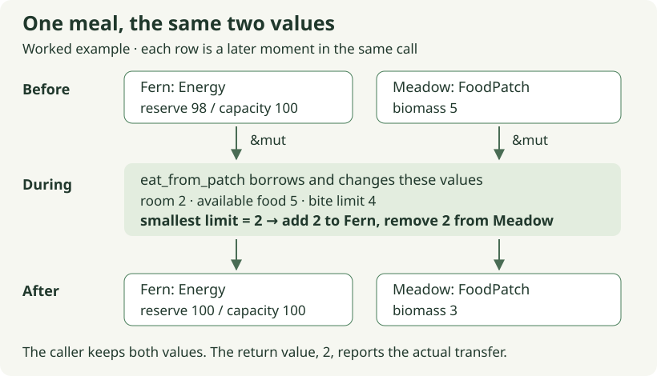

# 01. Turn contact into a finite meal

[Path home](README.md) · Previous: [today's movement](../today-v2.md) · Next: [sharing one patch](02-a-shared-meal.md)

**Future checkpoint · 20–30 minutes after reviewed movement.** The agent first
prepares `eat_from_patch` in `crates/moss-sim/src/lessons.rs`, its focused test
and the required imports. Your edit is the helper body. If today's stretch
already completed this helper, keep it: run its existing test, trace the case
below, then continue to session 02. There is no second implementation to write.

Fern has reached Meadow, but standing on grass is not yet eating. Movement gave
us an affordable change of position. Now we want an equally explainable transfer:
some biomass leaves the patch and becomes energy in Fern. Both
numbers must describe the same transfer.

## Carry the movement pattern forward

Recall the useful pause inside `move_one_cell`: it calculates a proposed change
before writing through either mutable reference. `&mut Position` and `&mut Energy`
let the helper update existing values without taking ownership of the whole
world. We can reuse that shape with `&mut Energy` and `&mut FoodPatch`. Rust's
borrows provide exclusive access during the call; the biological rule still has
to decide how much food is allowed.

Suppose Fern has reserve 98, capacity 100, and Meadow has 5 biomass. Our proposed
bite limit is 4 biomass per eating action. A bite of 4 would overfill Fern, while
removing 4 and awarding only 2 would make food disappear. The allowed transfer
is bounded by three quantities: available room, available biomass, and bite size.
Here the smallest is 2. Fern reaches 100 and Meadow keeps 3.



Follow the two values through the call. The helper does not return a replacement
Fern or Meadow; it writes into the caller's existing values. Its returned `2`
answers a different question: how much actually changed? After the call ends,
the caller can inspect both values again. The Rust book's
[borrowing explanation](https://doc.rust-lang.org/book/ch04-02-references-and-borrowing.html)
is optional background for that temporary exclusive access.

We use one biomass unit per energy unit for this first model. That conversion is
a chosen game rule, not a claim that biomass and energy are interchangeable
units. Giving the variables different names preserves the distinction when a
later food type has a different nutritional value. There is no separate eating
charge in this session; maintenance and travel retain their existing rules.

## One helper, two changed values

Your edit is the prepared `eat_from_patch` body in `lessons.rs`. Calculate one
allowed amount, use it for both mutations, and return it. The agent supplies the
test and imports. That is the whole change for this session.

The helper's arguments contain no position, species or target, so it cannot
establish whether eating is allowed here. The later ECS adapter checks that an
eligible grazer has reached its food before calling it. This repeats movement's
division of work: the adapter supplies an eligible interaction, and the helper
calculates its bounded effect.

## Check it, then stop at the helper

After the agent prepares the [live meal test](../05-eating.md#checkpoint-a--a-bounded-transfer),
run this command from the repository root:

```sh
scripts/with-toolchain.sh cargo test -p moss-sim --locked --test eating meals_respect_capacity_bite_size_and_shared_food -- --exact
```

Exactly one test should initially fail at your unfinished helper, then pass after
your edit. A compiler error or zero matching tests means the preparation needs
repair. This command imports the live helper, so it checks the code you changed.

If Fern ends at 100 but Meadow ends at 1, inspect which amount you subtract.
Using the nominal bite for the patch and the bounded amount for the animal
breaks the transfer even though Fern's individual result looks correct.

## A worked answer to trace when useful

The optional complete reference below includes a test that makes the same call
a second time. Trace that second call: reserve is now 100, so room is zero and
Meadow must keep its remaining 3. Later, the test resets reserve to zero to arrange
new cases; no maintenance or other ECS system runs. A smaller bite of 2 takes 2
from those 3 biomass. A following bite of 4 can take only the remaining 1.
Each limit gets a chance to determine the result: the nearly full animal alone
would not reveal a missing food-supply limit.

<!-- runnable: session-01 -->
```rust
use moss_sim::{Energy, FoodPatch};

fn eat_from_patch(energy: &mut Energy, patch: &mut FoodPatch, bite_limit: u32) -> u32 {
    let room = energy.capacity.saturating_sub(energy.reserve);
    let consumed = room.min(patch.biomass).min(bite_limit);
    energy.reserve = energy
        .reserve
        .checked_add(consumed)
        .expect("meal energy overflow");
    patch.biomass -= consumed;
    consumed
}

#[test]
fn session_01_a_meal_changes_both_participants() {
    let mut fern = Energy {
        reserve: 98,
        capacity: 100,
    };
    let mut meadow = FoodPatch {
        name: "Meadow",
        biomass: 5,
    };

    assert_eq!(eat_from_patch(&mut fern, &mut meadow, 4), 2);
    assert_eq!(fern.reserve, 100);
    assert_eq!(meadow.biomass, 3);
    assert_eq!(eat_from_patch(&mut fern, &mut meadow, 4), 0);
    assert_eq!(meadow.biomass, 3);

    fern.reserve = 0;
    assert_eq!(eat_from_patch(&mut fern, &mut meadow, 0), 0);
    assert_eq!(fern.reserve, 0);
    assert_eq!(meadow.biomass, 3);

    assert_eq!(eat_from_patch(&mut fern, &mut meadow, 2), 2);
    assert_eq!(fern.reserve, 2);
    assert_eq!(meadow.biomass, 1);

    assert_eq!(eat_from_patch(&mut fern, &mut meadow, 4), 1);
    assert_eq!(fern.reserve, 3);
    assert_eq!(meadow.biomass, 0);
    assert_eq!(eat_from_patch(&mut fern, &mut meadow, 4), 0);
    assert_eq!(fern.reserve, 3);
    assert_eq!(meadow.biomass, 0);
}
```

`saturating_sub` gives zero room if reserve already meets or exceeds capacity.
It does not repair an overfull animal; it simply grants no additional food.
The subsequent `min` calls successively tighten an upper bound. Because
`consumed` cannot exceed current biomass, subtracting it cannot underflow.
The checked energy addition would report an unexpected overflow explicitly.

The final `consumed` expression returns the actual transfer. That is useful
information for an event later: a request for 4 is not evidence of a meal of 4.
Notice also that the full-animal case needs no separate mutation branch. Zero
is a valid transfer, and applying zero changes neither participant.

**Optional:** run the complete answer; expect one passing reference test.

```sh
python3 docs/tutorial/authoring/check_path_examples.py --session 01
```

[What this checks](README.md#checking-your-work) · [Recorded evidence](verification.md)

Send: **“Session 01's meal helper is green. Review the shared transfer amount
and boundary cases, then prepare session 02's installed meal regression.”**
Stop once that small rule is understood. Next we will keep the helper unchanged
and ask what happens when another hare reaches the same finite patch.
