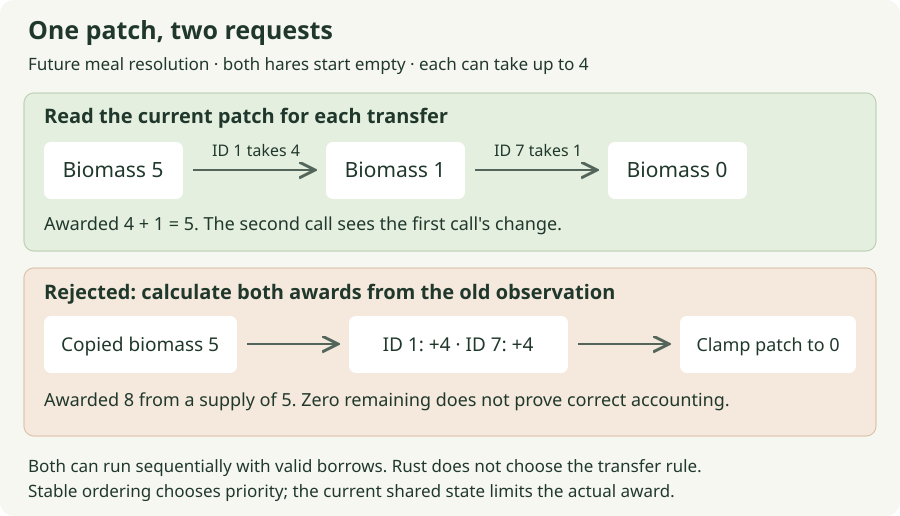

# 02. Let two animals share one finite patch

[Path home](README.md) · Previous: [a bounded meal](01-bounded-meal.md) · Next: [finding food](03-finding-food.md)

**Future checkpoint · 20–30 minutes after the meal helper is reviewed.** The
agent prepares the same-cell ECS adapter, explicit ascending-`SimId` resolution,
actual-meal records and an installed regression in the future `tests/eating.rs`.
Your edit is the regression's reversed-order check. The agent preserves your
reviewed transfer helper and handles integration outside this focus block.

If today's meal stretch already verified both spawn orders and the browser
arrival, keep those checks. Trace the existing regression with this page, then
continue to [finding food](03-finding-food.md); there is no duplicate test to add.

One meal was a calculation between two values. Two meals introduce a different
question: which animal sees the patch first? If Meadow contains 5 biomass and
each hungry hare can take 4, they cannot both receive a full bite. We need an
outcome the simulation can reproduce and the inspector can explain.

## A borrow protects access; a rule chooses the winner

Remember that `eat_from_patch` subtracts the amount it actually awards. Calling
it once leaves less food for the next call. That prevents double spending only
when each caller sees the current patch, rather than awarding both meals from
the same earlier snapshot. Rust prevents certain conflicting borrows, but it
does not decide which animal ought to eat first.

For this prototype, lower `SimId` eats first. That deliberately simple conflict
rule gives the same result when we change spawn order or Bevy rearranges storage.
It is repeatable, not necessarily fair across a long run: lower IDs can repeatedly
win. Rotating priority or controlled randomness can become later experiments
when this bias matters. Relying on incidental query order would hide the policy.

Consider a tempting mistake: save `available = patch.biomass` when it is 5,
calculate both awards as 4 from that copy, then apply them one at a time. Each
mutation can have its own valid mutable borrow. If subtraction clamps at zero,
the patch ends empty, but the animals gained 8 from a supply of 5. Sorting those
awards still produces the wrong total. The defect is using an old observation
as permission to spend; there need not be threads or simultaneous execution.



Before a request joins that ordered set, the real adapter checks that the animal
is a grazer, its target resolves to a nonempty grass patch, and their simulation
cells match. Sprite overlap is irrelevant. Flint cannot eat grass simply because
he also has an `Energy` component. The reference below begins **after eligibility**
and isolates conflict resolution so that those separate responsibilities stay clear.
An eligible request reserves nothing: the transfer still reads the current patch
when that animal's turn arrives.

## Make the order visible in a small example

Imagine ID 7 arrived first in our input list. Sorting places ID 1 first anyway.
We then make two calls to the reviewed transfer helper:

| Call | Actual transfer and remaining patch |
| --- | --- |
| ID 1, patch contains 5 | Take 4; the patch now contains 1. |
| ID 7, patch contains 1 | Take 1; the patch now contains 0. |

Reverse the input list and this trace should stay identical. Your edit adds that
second setup to the prepared installed test in `tests/eating.rs`, checking each
animal **by stable ID**, rather than by its position in a returned collection.
The fixture gives both animals zero reserve and zero maintenance, so their final
reserves reveal exactly what their meals awarded. The agent supplies its setup
and lookup helpers before the session.

If Meadow starts with **4** instead, ID 1 takes all 4 and ID 7 receives 0.
Both were eligible candidates, but only one meal happened. The reference also
checks this case: one `Meal` record, not two records with a zero-sized second meal.
This is the connection to next session's target selection: choosing a patch
expresses an intention; the later transfer determines the actual outcome.

## Your one check and the browser consequence

Run the prepared installed regression after adding the reversed-order case.
The agent records its exact command when preparing `tests/eating.rs`; the test
must exercise the installed meal system, not call the local resolver printed
below. Both orders must leave ID 1 at 4, ID 7 at 1, and biomass at 0. Before the
ordering rule is installed, an order-dependent implementation should fail one
case. If reversing spawn order reverses the winner, inspect where stable-ID
sorting happens before transfers. If both pass without sorting, the agent checks
whether the fixture actually changed iteration order rather than treating that
alone as proof of the rule.

## Follow the complete ordering example

The **optional worked reference** below uses a slice of eligible eaters to expose
the same ordering. Its local `eat_from_patch` is the previous session's rule,
included so this page runs independently. `resolve_meals` calls it unchanged.
The local `Meal` records are observations of actual transfers; production journal
wiring remains agent preparation.

<!-- runnable: session-02 -->
```rust
use moss_sim::{Energy, FoodPatch, SimId};

#[derive(Debug, PartialEq, Eq)]
struct Meal {
    eater: SimId,
    consumed: u32,
}

fn eat_from_patch(energy: &mut Energy, patch: &mut FoodPatch, bite_limit: u32) -> u32 {
    let room = energy.capacity.saturating_sub(energy.reserve);
    let consumed = room.min(patch.biomass).min(bite_limit);
    energy.reserve = energy
        .reserve
        .checked_add(consumed)
        .expect("meal energy overflow");
    patch.biomass -= consumed;
    consumed
}

fn resolve_meals(eaters: &mut [(SimId, Energy)], patch: &mut FoodPatch) -> Vec<Meal> {
    eaters.sort_by_key(|(id, _)| *id);
    let mut meals = Vec::new();
    for (id, energy) in eaters {
        let consumed = eat_from_patch(energy, patch, 4);
        if consumed > 0 {
            meals.push(Meal {
                eater: *id,
                consumed,
            });
        }
    }
    meals
}

#[test]
fn session_02_order_is_a_rule_not_an_accident() {
    for ids in [[SimId(1), SimId(7)], [SimId(7), SimId(1)]] {
        let mut eaters = ids.map(|id| {
            (
                id,
                Energy {
                    reserve: 0,
                    capacity: 100,
                },
            )
        });
        let mut patch = FoodPatch {
            name: "Meadow",
            biomass: 5,
        };
        let meals = resolve_meals(&mut eaters, &mut patch);
        assert_eq!(eaters[0].0, SimId(1));
        assert_eq!(eaters[0].1.reserve, 4);
        assert_eq!(eaters[1].0, SimId(7));
        assert_eq!(eaters[1].1.reserve, 1);
        assert_eq!(patch.biomass, 0);
        assert_eq!(
            meals,
            vec![
                Meal {
                    eater: SimId(1),
                    consumed: 4
                },
                Meal {
                    eater: SimId(7),
                    consumed: 1
                },
            ]
        );
    }

    let hungry = Energy {
        reserve: 0,
        capacity: 100,
    };
    let mut eaters = [(SimId(7), hungry), (SimId(1), hungry)];
    let mut patch = FoodPatch {
        name: "Meadow",
        biomass: 4,
    };
    let meals = resolve_meals(&mut eaters, &mut patch);
    assert_eq!(eaters[0].1.reserve, 4);
    assert_eq!(eaters[1].1.reserve, 0);
    assert_eq!(patch.biomass, 0);
    assert_eq!(
        meals,
        vec![Meal {
            eater: SimId(1),
            consumed: 4,
        }]
    );

    let mut fern = [(
        SimId(1),
        Energy {
            reserve: 33,
            capacity: 100,
        },
    )];
    let mut meadow = FoodPatch {
        name: "Meadow",
        biomass: 80,
    };
    fern[0].1.reserve = fern[0].1.reserve.saturating_sub(1); // Maintenance.
    let meals = resolve_meals(&mut fern, &mut meadow); // Already at the target.
    assert_eq!(fern[0].1.reserve, 36);
    assert_eq!(meadow.biomass, 76);
    assert_eq!(meals[0].consumed, 4);
}
```

If you are tracing the optional reference, the closure bars introduce a small
function; the method calling it determines its input. `sort_by_key` lends its
closure one `(SimId, Energy)` pair, so `id` is a reference and `*id` copies the
sorting key. The array's `map` supplies each `SimId` by value, so its closure
already receives the ID. These calls prepare the example; your live edit remains
the reversed-order assertions.

Each call borrows the same patch after the previous call has finished. The first
call's mutation is therefore the second call's input. Sorting answers *who goes
first*; borrowing the current patch and transferring one bounded amount answers
*how much remains*. Those are separate responsibilities.
`hungry` supplies two independent copies of the same initial `Energy` value;
changing one animal's reserve does not change the other's. Copying an observation
is useful, but that copy does not update when the source changes. The current
patch remains authoritative for each transfer.

The final case checks an animal already at food: `33 − 1 + 4 = 36`. Maintenance
costs 1 and the actual meal is 4, although the net gain is only 3. An event should
record the helper's returned amount, not infer a meal from a tick's final reserve.

**Optional:** run the complete answer; expect one passing reference test.

```sh
python3 docs/tutorial/authoring/check_path_examples.py --session 02
```

[What this checks](README.md#checking-your-work) · [Recorded evidence](verification.md)

After agent integration, Reset and step Fern's original nine-cell journey.
Eating on arrival should leave reserve **37** and Meadow biomass **76**: movement
alone left 33, then the new meal contributed 4. The inspector must describe the
actual meal, not infer it from reserve alone. These are future acceptance values.

Send: **“Session 02's two-order regression is green. Review eligibility, actual
outcomes and schedule order, then verify arrival and stop before food choice.”**
Fern can now execute an instruction and benefit from it. The next question is
how she can select that instruction for herself.
