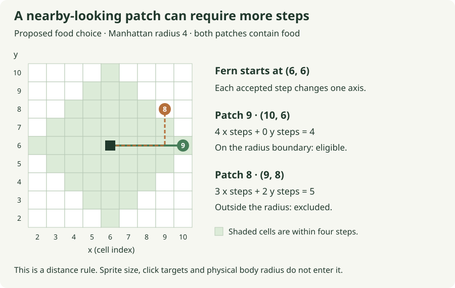

# 03. Replace an authored destination with a choice

[Path home](README.md) · Previous: [sharing a patch](02-a-shared-meal.md) · Next: [when to seek](04-when-to-seek.md)

**Future checkpoint · 20–30 minutes after the installed meal works.** The agent
prepares `nearest_food` in `crates/moss-sim/src/lessons.rs`, its imports and focused
selection test. Your edit is its body. Movement and eating keep their reviewed
implementations; this helper does not move an animal or mutate a patch.

Fern has followed the `FoodTarget` placed on her by the fixture. You have already
made that target meaningful: movement resolves its stable ID, and eating requires
contact with the corresponding patch. We can now change where the target comes
from while keeping those consequences intact. A small choice can reuse quite a
lot of behavior.

## Describe the choice before the loop

Among nearby, nonempty grass patches, choose the nearest. Nearby means within a
configured Manhattan distance: absolute x difference plus absolute y difference.
This matches the cardinal movement model because a step changes only one axis.
Fern's original route from `(10, 10)` to `(16, 13)` is therefore nine cells, even
though a straight line drawn between the sprites looks shorter.

The shape of that reach matters. In a separate small example, put Fern at `(6, 6)`
with radius 4. A patch at `(10, 6)` is exactly four steps away and qualifies.
A patch at `(9, 8)` needs three x steps and two y steps, so it falls outside—even
though its straight-line distance is less than four. In this obstacle-free model,
Manhattan distance gives the fewest cardinal steps. It does not simulate blocked
routes or line of sight.



Recall why the meal adapter used stable IDs rather than query order. The same
issue appears when two patches are equally near. We will compare distance first
and ID second. That makes the tie rule visible, repeatable and independent of
storage order. Radius 10 allows Fern to perceive Meadow in the diagnostic scene;
it is a demonstration setting, not a species claim.

Sometimes no patch qualifies. Returning a made-up ID would postpone that fact
until movement tries to resolve it. Rust's `Option<SimId>` states the result
directly: `Some(id)` contains a choice, while `None` means no eligible food.
The function therefore has two kinds of successful result: finding a patch,
and establishing that none qualifies. Neither requires inventing a destination.

## A borrowed slice and a running best candidate

The helper receives a borrowed slice of patch observations. It can inspect those
values without owning or changing the caller's collection. Each observation is
a small tuple of stable ID, position and available biomass; the adapter supplies
grass patches only. `best` remembers the strongest candidate encountered so far.
These observations help select an opportunity; they do not reserve its biomass.
Another hare may eat before Fern, so the meal resolver still checks the current
patch, as the [shared-meal trace](02-a-shared-meal.md#make-the-order-visible-in-a-small-example)
shows.

Before writing the loop, follow its working memory through three observations.
Fern stands at `(2, 2)`. Patches 9 and 4 are one step away; patch 3 is two away.

| Observation | `best` after considering it |
| --- | --- |
| Nothing inspected yet | `None`: there is no candidate to beat. |
| Patch 9, distance 1 | `Some((1, SimId(9)))`: accept the first candidate. |
| Patch 4, distance 1 | `Some((1, SimId(4)))`: equal distance, lower ID wins. |
| Patch 3, distance 2 | Still `Some((1, SimId(4)))`: a lower ID cannot beat a closer patch. |

That pair stores distance first because Rust compares tuples from left to right.
We retain both fields while deciding, then return only the chosen ID. Empty and
out-of-range patches skip this comparison entirely.

Your live edit is the prepared `nearest_food` body in `lessons.rs`. Keep the
existing movement and eating functions.

## Check one decision without running a whole life

After preparation, run the live helper's test from the repository root:

```sh
scripts/with-toolchain.sh cargo test -p moss-sim --locked --test foraging nearest_food_is_local_nonempty_and_stable -- --exact
```

The [selection chapter](../03-food-choice.md#checkpoint-a--a-test-for-selection)
describes this prepared test. It should fail at the unfinished helper before your
edit and pass exactly one test afterward. It imports your live `nearest_food`,
so changing that function changes the result. Patch 4 should win the tie even
after reversal; empty patches never qualify. Radius zero still permits nonempty
food on the current cell.

If patch 3 wins, inspect whether you compare ID before distance. If patch 1
wins, inspect the biomass filter. Neither mistake requires changing movement:
the defect is in the instruction being supplied to it.

## Follow the choice through Rust

The optional complete answer is available to trace or copy into the prepared
helper body. Its `match` spells out each form of `Option`; the local test makes
the reference runnable independently. This checks selection; the scheduled
`FoodTarget` update follows in session 04.

<!-- runnable: session-03 -->
```rust
use moss_sim::{Position, SimId};

fn nearest_food(
    origin: Position,
    patches: &[(SimId, Position, u32)],
    radius_cells: u32,
) -> Option<SimId> {
    let mut best: Option<(u32, SimId)> = None;
    for &(id, position, biomass) in patches {
        if biomass == 0 {
            continue;
        }
        let distance = origin
            .x
            .abs_diff(position.x)
            .checked_add(origin.y.abs_diff(position.y))
            .expect("grid distance overflow");
        if distance > radius_cells {
            continue;
        }
        let candidate = (distance, id);
        let improves_choice = match best {
            None => true,
            Some(previous) => candidate < previous,
        };
        if improves_choice {
            best = Some(candidate);
        }
    }
    best.map(|(_, id)| id)
}

#[test]
fn session_03_choices_survive_reordered_observations() {
    let origin = Position { x: 2, y: 2 };
    let mut patches = vec![
        (SimId(9), Position { x: 1, y: 2 }, 80),
        (SimId(4), Position { x: 3, y: 2 }, 80),
        (SimId(3), Position { x: 4, y: 2 }, 80),
        (SimId(1), origin, 0),
        (SimId(2), Position { x: 7, y: 2 }, 80),
    ];
    assert_eq!(nearest_food(origin, &patches, 2), Some(SimId(4)));
    patches.reverse();
    assert_eq!(nearest_food(origin, &patches, 2), Some(SimId(4)));
    assert_eq!(nearest_food(origin, &patches, 0), None);
    assert_eq!(nearest_food(origin, &[], 2), None);
    assert_eq!(
        nearest_food(origin, &[(SimId(8), origin, 1)], 0),
        Some(SimId(8))
    );

    let diagonal_case = [
        (SimId(8), Position { x: 9, y: 8 }, 80),
        (SimId(9), Position { x: 10, y: 6 }, 80),
    ];
    assert_eq!(
        nearest_food(Position { x: 6, y: 6 }, &diagonal_case, 4),
        Some(SimId(9))
    );
}
```

The slice yields borrowed observations. In `for &(id, position, biomass)`, the
leading `&` pattern opens one borrowed tuple; the names receive copies because
all three fields are small `Copy` values. The caller keeps its collection, and
this loop never changes it. `continue` advances to the next observation, which
is why an empty or distant patch never enters the choice table above.

The `match` chooses one arm and produces its value: `None` accepts the first
candidate; `Some(previous)` asks whether we have a better one. At the end, `map`
does a simpler job: `Some((distance, id))` becomes `Some(id)`, and `None` remains
`None`. Its `|(_, id)| id` argument is a closure, a small unnamed function that
returns the ID and ignores the distance. It runs only when a value is present.
Rust's [Option reference](https://doc.rust-lang.org/std/option/enum.Option.html)
is optional background for that operation.

The last case checks the geometry, not just the loop. The earlier candidates
lie on one axis, where straight-line and Manhattan distance agree. Patch 8 in
the diagonal case would win under straight-line distance; expecting patch 9
makes that different rule visible to the test. It also checks that a patch
exactly at the permitted radius remains eligible.

**Optional:** run the complete answer; expect one passing reference test.

```sh
python3 docs/tutorial/authoring/check_path_examples.py --session 03
```

[What this checks](README.md#checking-your-work) · [Recorded evidence](verification.md)

Send: **“Session 03's nearest-food helper is green. Review the loop, absence and
tie rule; prepare the hunger-state helper before activating automatic choice.”**
Stop at that decision. Next we will give Fern a reason to choose food now and
keep seeking it long enough to finish a useful meal.
