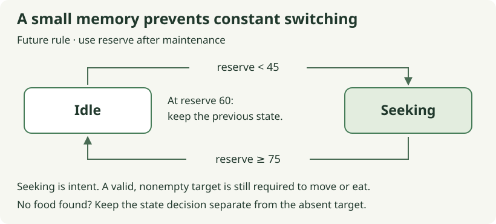

# 04. Give an activity enough memory to continue

[Path home](README.md) · Previous: [finding food](03-finding-food.md) · Next: [many individuals](05-many-individuals.md)

**Future checkpoint · 20–30 minutes after selection is reviewed.** The agent
prepares the `ForagingState` component and a `next_foraging_state` helper landmark,
plus a focused test in the future `tests/foraging.rs`. Your edit is the transition
helper. The agent wires activity, target updates and their inspector fields,
leaving the biological thresholds visible for review.

Fern can identify nearby food, but that does not tell us whether she should seek
it on every tick. If she is comfortable at reserve 60, staying idle is reasonable.
If she has begun a meal and recovered from 30 to 60, stopping immediately may be
less useful. The same reserve can support two decisions because the animal's
recent activity differs.

## Keep one remembered fact

Recall that `Option<SimId>` represented whether a target existed. An enum can
represent another small set of alternatives: `Idle` or `Seeking`. This state is
stored on the individual because Fern and another hare may be doing different
things. We used `match` to handle `Some` and `None` in the selection helper; here
we will handle two alternatives we define ourselves.

Use the proposed rule already described in the food-choice chapter: an idle
grazer starts seeking below 45 reserve, while a seeking grazer stops at 75 or
above. Between those thresholds, preserve the previous state. Two thresholds
avoid repeatedly switching around a single boundary after every small meal.
The name for this dependence on previous state is **hysteresis**.

The numbers refer to energy units for the current capacity-100 animals. They
are teaching settings rather than balanced behavior. Maintenance runs before
choice, so the helper receives the reserve left after that cost. A hare that
starts a tick at 45 first reaches 44, then begins seeking. A seeking hare that
starts at 76 reaches 75, then stops.

## Express a transition with `match`



Follow the arrows using the reserve **after maintenance**. At 60, neither arrow
applies, so the existing state survives. The gap is the memory; no hidden timer
or hunger score is needed. A valid target remains a separate question, shown
beneath the state diagram.

Edit the prepared `next_foraging_state` body. It takes the previous state and
reserve after maintenance, then returns a new state. The agent supplies the enum
and focused test; the live edit needs only the helper body.

For your checkpoint, run the live transition test the agent prepares in
`tests/foraging.rs`. The handoff must include its exact command before you start.
An unfinished body should fail; your edit should make both reserve-60 cases pass
with different answers. If both return Idle, inspect the fallback arm. This proves
the transition; the agent then checks the data flow described below through the
schedule.

The **optional complete answer** includes the enum and focused test locally so
you can follow both reserve-60 cases or run the reference independently.

<!-- runnable: session-04 -->
```rust
#[derive(Clone, Copy, Debug, PartialEq, Eq)]
enum ForagingState {
    Idle,
    Seeking,
}

fn next_foraging_state(previous: ForagingState, reserve: u32) -> ForagingState {
    match previous {
        ForagingState::Idle if reserve < 45 => ForagingState::Seeking,
        ForagingState::Seeking if reserve >= 75 => ForagingState::Idle,
        _ => previous,
    }
}

#[test]
fn session_04_the_middle_band_remembers_activity() {
    use ForagingState::{Idle, Seeking};

    assert_eq!(next_foraging_state(Idle, 44), Seeking);
    assert_eq!(next_foraging_state(Idle, 45), Idle);
    assert_eq!(next_foraging_state(Idle, 60), Idle);
    assert_eq!(next_foraging_state(Seeking, 60), Seeking);
    assert_eq!(next_foraging_state(Seeking, 74), Seeking);
    assert_eq!(next_foraging_state(Seeking, 75), Idle);

    let after_maintenance = 45_u32.saturating_sub(1);
    assert_eq!(next_foraging_state(Idle, after_maintenance), Seeking);
    let after_maintenance = 76_u32.saturating_sub(1);
    assert_eq!(next_foraging_state(Seeking, after_maintenance), Idle);
}
```

`match` selects the first matching arm. An arm's `if` condition is called a guard;
it narrows when that arm applies. The final `_` catches remaining cases and returns
the existing state. Because each arm produces a value, the whole `match` expression
is the function's result. This makes the unchanged middle band explicit instead
of silently defaulting every animal back to idle.

There is deliberately no energy mutation here. Deciding twice must not charge
twice. Maintenance owns its per-tick cost; movement owns the cost of an accepted
step; eating owns its finite transfer. A policy can inspect those values and
produce an instruction without also performing the instructed action.

## Turn the decision into behavior

The ordinary helper returns a value. The ECS adapter stores that value on Fern,
then updates her `FoodTarget` component. Later, movement queries that component
and acts on it. Choice does not call movement: the systems communicate through
data on the same entity. Here is the connection the agent will prepare:

| Choice result | Data for the later movement system |
| --- | --- |
| `Seeking`, and `nearest_food` returns `Some(id)` | Set `FoodTarget(id)` so movement has a destination. |
| `Seeking`, but selection returns `None` | Remove any old `FoodTarget`; keep the `Seeking` state. |
| `Idle` | Remove any old `FoodTarget`; there is no travel instruction. |

Suppose Fern was seeking Meadow, but another hare ate its last biomass. She can
still need food while having nowhere to go. That is `Seeking` with no target,
not `Idle`, and not permission to keep following an obsolete instruction. The
two components answer different questions: *what am I trying to do?* and *where
can I currently do it?*

The installed order becomes maintenance → choice → movement → eating → complete
tick. Movement must see the choice from this same tick. During integration the
agent tests that a withdrawn target prevents a step immediately. If the adapter
uses deferred ECS commands, making those commands visible before movement is
part of that preparation.

**Optional:** run the complete answer; expect one passing reference test.

```sh
python3 docs/tutorial/authoring/check_path_examples.py --session 04
```

[What this checks](README.md#checking-your-work) · [Recorded evidence](verification.md)

After review, the agent demonstrates a hungry hare choosing, traveling and
eating, then stopping after reaching the upper threshold on a later choice pass.
Foxes must still receive no grass target. A missing patch must clear the old
destination without inventing a meal.

One inspector result may look wrong at first: **reserve 77, still Seeking**.
In the proposed loop, start a seeking hare on a patch with 8 biomass at reserve 74,
with no other eater or plant growth. Maintenance
leaves 73, choice keeps Seeking, then a four-unit meal raises reserve to 77.
The displayed reserve comes after the meal; it was not the input to that choice.
On the next tick, maintenance leaves 76 and choice switches to Idle, clearing
the target before eating. No further meal occurs on that tick; the patch still
has the 4 biomass left from the first meal.

Before changing a threshold to fix an apparent mismatch, pause and compare those
two ticks. The agent prepares this same-cell case, checks reserve, activity,
target and biomass through the installed schedule, and shows the relevant inputs
during review. If Seeking remains
after the second choice, inspect the value supplied to the helper and whether its
returned state was stored. The helper test alone cannot verify either connection.

Send: **“Session 04's transition test is green. Review the thresholds and target
clearing, then verify autonomous foraging through the installed schedule.”**
That is the first autonomous loop: Fern's condition now changes her activity.
Next we can add other individuals and ask whether they experience the same world.
