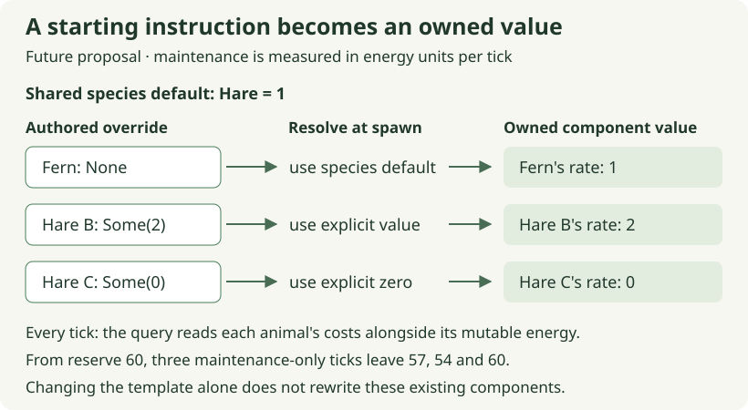

# 06. Give each animal a baseline it owns

[Path home](README.md) · Previous: [many individuals](05-many-individuals.md) · Next: [querying costs](07-querying-costs.md)

**Future checkpoint · 20–30 minutes after the population observation is reviewed.**
The agent prepares a current green baseline and reconciles the existing
[individual-cost chapter](../01d-energy-profiles.md). The component, public
re-export and test are preparation. Your edit is the body of `resolve_costs` in
`crates/moss-sim/src/energy.rs`: decide whether a spawn uses an override or its
species default. Spawn attachment follows through review; maintenance changes
in session 07.

Two hares can share a species and still differ in upkeep. We might author Fern
at the hare default of 1 unit per tick and another hare at 2. A species lookup
alone cannot express that difference. We need to decide who owns the value
the maintenance rule will actually read.

## A template answers a different question from an instance

Recall that `Energy` is already individual: a meal changes Fern's reserve without
changing every hare. `SpeciesEnergyRules` is shared configuration. We will retain
species defaults as starting instructions and resolve each animal's maintenance
rate when the animal is created. The resolved value lives in a small component
on that animal. During a run, it is the authoritative baseline.

This choice addresses the earlier concern about repeated attribute lookups.
Maintenance will read a concrete value beside `Energy`, rather than search a
chain of individual override, species default and fallback on every tick. It
also gives the number a straightforward ownership story. It is a maintainability
decision, not a measured claim that this layout is fastest for every population.

An authored override needs to distinguish **missing** from **zero**. We already
used `Option` when there might be no food target and no population mean. Here
`None` means use the species default, while `Some(0)` means this animal explicitly
has zero maintenance. Testing `override > 0` would destroy that distinction.

Equal numbers can also come from different instructions. With default 1, both
`None` and `Some(1)` create a cost of 1. If a later scenario uses default 9,
the same authored inputs create 9 and 1. The explicit override still means
“this animal costs 1.” Keep that authored input for reconstruction; the resolved
number alone cannot tell us whether an override was supplied.



Read the diagram in two moments. During creation, the initializer needs the
template and an optional override. During maintenance, that decision is already
settled: the query needs only the animal's cost component. The template is not
consulted again every time Fern pays upkeep. This separates authoring a default
from owning a runtime value.

## Keep the component small and concrete

The prepared component has one field, `maintenance_units_per_tick`. Your helper
returns a component populated from `Some(value)`, or from the species default
when the override is `None`. This is the same two-way `Option` choice we used for
food selection. Here `unwrap_or(fallback)` expresses it directly: take the value
inside `Some`, including zero, otherwise use the fallback.

One field is enough for this rule; it is not a rule that every number needs its
own component. The optional [component-boundary comparison](../context/attributes-and-defaults.md#where-would-one-more-attribute-live)
shows when another attribute might belong alongside existing fields or separately.

## Check initialization before attachment

Run the live `resolve_costs` test prepared with your helper. Its exact file and
command are part of the agent's handoff before you start. The test must call the
live helper and check all three override cases: `None → 1`, `Some(2) → 2`, and
`Some(0) → 0`. It should fail at the unfinished body, then pass after your edit.
If explicit zero becomes 1, inspect how absence is handled.

## Trace a resolved value

The **optional worked answer below** includes its own component and ownership
test so it can run independently. Edit only the prepared live helper body.
`MovementRules` continues to supply the shared travel rate of 2 units per cell;
no new travel setting or attribute framework is part of this change.

<!-- runnable: session-06 -->
```rust
use bevy_ecs::prelude::Component;

#[derive(Component, Clone, Copy, Debug, PartialEq, Eq)]
pub struct AnimalEnergyCosts {
    pub maintenance_units_per_tick: u32,
}

fn resolve_costs(
    species_default: AnimalEnergyCosts,
    maintenance_override: Option<u32>,
) -> AnimalEnergyCosts {
    AnimalEnergyCosts {
        maintenance_units_per_tick: maintenance_override
            .unwrap_or(species_default.maintenance_units_per_tick),
    }
}

#[test]
fn session_06_an_override_is_resolved_at_creation() {
    let mut hare_default = AnimalEnergyCosts {
        maintenance_units_per_tick: 1,
    };
    let fern = resolve_costs(hare_default, None);
    let explicit_one = resolve_costs(hare_default, Some(1));
    let other_hare = resolve_costs(hare_default, Some(2));
    let free_upkeep = resolve_costs(hare_default, Some(0));
    assert_eq!(fern.maintenance_units_per_tick, 1);
    assert_eq!(explicit_one, fern); // Equal results can have different authored inputs.
    assert_eq!(other_hare.maintenance_units_per_tick, 2);
    assert_eq!(free_upkeep.maintenance_units_per_tick, 0);

    hare_default.maintenance_units_per_tick = 9;
    assert_eq!(fern.maintenance_units_per_tick, 1);
    assert_eq!(other_hare.maintenance_units_per_tick, 2);
    assert_eq!(
        resolve_costs(hare_default, None).maintenance_units_per_tick,
        9
    );
    assert_eq!(
        resolve_costs(hare_default, Some(1)).maintenance_units_per_tick,
        1
    );
}
```

`#[derive(Component)]` lets Bevy store this type on an entity; it does not attach
it automatically. `Copy` means passing this small value copies its fields. There
is no shared pointer back to the template in `fern`. Changing the template in
the reference therefore leaves existing values alone and affects only a later
construction.

The last two calls construct new values from the changed test template. They
explain why `None` and `Some(1)` must remain distinct in authored scenario data;
they do not run Moss's Reset or retune an existing animal. The initializer tests
the resolution rule. Later construction and Reset tests must check that the
scenario retained the intended input.

Moss keeps defaults fixed during a run. The template mutation above demonstrates
ownership, not a proposed browser control. Live retuning could be added later as
an explicit operation with rules for preserving overrides. Reset instead rebuilds
animals from their authored scenario, so runtime-only changes disappear while
authored overrides are applied again.

There is no universal default hidden in this helper. If a scenario configures
Fox maintenance as 2, spawn code must pass that configured value rather than
the hare's 1. The helper does not need to know which species supplied the value.
The agent's construction tests check that each animal receives the right input
and that grass receives no animal cost component.

<a id="a-declaration-is-a-useful-checkpoint-not-runtime-behavior"></a>

Defining and constructing a component does not attach it to Fern or make
maintenance read it. Those are separate connections. The agent prepares the
declaration and deliberate re-export through `lib.rs`, preserving existing energy
exports. A re-export gives callers another path to the same type; it does not
create a copy of the type. The helper lives in `energy.rs`; an external integration
test needs a public helper and a deliberate root re-export. Other helpers can
stay private until a caller requires access.

**Optional:** run the complete answer; expect one passing reference test.

```sh
python3 docs/tutorial/authoring/check_path_examples.py --session 06
```

[What this checks](README.md#checking-your-work) · [Recorded evidence](verification.md)

Send: **“Session 06's initializer test is green. Review ownership and the zero override,
then prepare attachment checks and the same-species maintenance regression.”**
Stop with the initialization understood. Next the query will read these individual values,
which is the point at which they begin to affect Fern's world.
