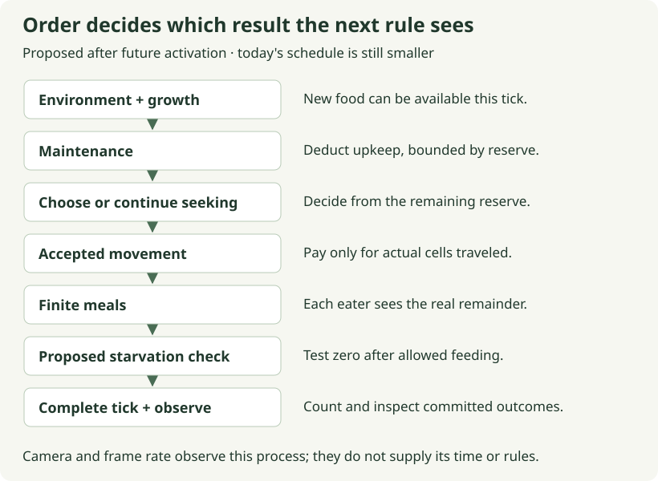

# 10. Let a new blade of grass become a meal

[Path home](README.md) · [Previous: growing grass](09-growing-grass.md) · [Next: a day from ticks](11-a-day-from-ticks.md)

**Future session · 20–30 minutes.** Your edit is one installed regression,
planned as `growth_is_available_to_eat_this_tick` in
`crates/moss-sim/tests/growth.rs`. The agent first wires the reviewed growth
helper into a system before maintenance, choice, movement and eating. It also
prepares an isolated test fixture and exposes actual growth for inspection.
This integration is not installed by reading this page.

## Put the two rules next to each other

The growth helper returns biomass actually created; the meal helper returns
biomass actually transferred. Remember that a mutable borrow lets each helper
change existing values without moving ownership of those values. Now the useful
question is what happens when both helpers touch Meadow in one tick.

Consider an empty patch and Fern already standing on its cell. If growth runs
first, the patch receives 1 unit and Fern can immediately eat it. If eating runs
first, Fern gets nothing until a later tick. Both orders can be implemented
without a compiler error. Their difference is a simulation rule, so it belongs
in an explicit schedule and an example with literal expectations.

We choose growth first. Future choice must therefore observe the replenished
patch too: a formerly empty target can become eligible before this tick's
decision. That is why the integration preparation orders growth before choice,
not merely before the final transfer. Your test will protect this connection
while the small reference below isolates the arithmetic underneath it.



Read the diagram in execution order: later phases receive the state produced by
earlier ones. Today's integration adds growth before the existing foraging
phases. The environment and lifecycle boxes locate later lessons; their presence
in the diagram does not mean those systems are installed or their policies
already accepted.

## Account for the source, transfer and destination

For this test only, remove maintenance and travel costs and keep Fern in contact
with Meadow. Prepare Fern in `ForagingState::Seeking` with **no `FoodTarget`**;
the empty patch must earn its place as a target during this tick. Starting with
energy 20 and biomass 0, growth adds 1, choice accepts Meadow, then a bite limit
of 4 permits a transfer of only 1. The end is energy 21 and biomass 0.
Across those two stores, the total increased by exactly the actual growth.
The bite did not create extra energy; it moved a finite amount between stores
under our chosen 1:1 conversion.

The missing target is part of the experiment. Today's diagnostic fixture authors
Fern's destination, so reusing it unchanged could let eating succeed without
proving that choice saw new growth. A seeking animal without a destination is
already a state you learned in session 04: wanting food does not mean food exists.
This tick gives that animal a new opportunity to discover.

This account is not a claim that biomass and animal energy are naturally the
same unit. Their numeric relationship is a demonstration rule. If conversion
changes later, the accounting test must express that relationship explicitly.
Similarly, a normal tick spends maintenance and perhaps travel energy, so its
total will also include those losses. An isolated test prevents unrelated costs
from obscuring the particular contract we are learning.

## Write the integration expectation

Add the prepared installed test's final assertions: Meadow becomes the
accepted target, Fern ends at reserve 21, and the patch ends at biomass 0. The
agent supplies the ECS setup and live test command; you state the biological
outcome. If the result is reserve 20 and biomass 1, inspect whether choice ran
before growth or whether its new target became visible too late for eating.

The agent checks this regression by temporarily placing choice before growth
in an isolated copy. That order should fail because choice sees no edible
patch. A test that still passes may have retained an authored target during
setup; it would not protect the connection we mean to test.

The **optional worked reference** below contains both local rules and their
accounting. It does not exercise the live schedule or target selection; see
[checking your work](README.md#checking-your-work) for that distinction.

<!-- runnable: session-10 -->
```rust
use moss_sim::{Energy, FoodPatch};

fn grow(patch: &mut FoodPatch, capacity: u32, rate: u32) -> u32 {
    assert!(patch.biomass <= capacity);
    let actual = rate.min(capacity - patch.biomass);
    patch.biomass = patch.biomass.checked_add(actual).expect("biomass overflow");
    actual
}

fn eat(energy: &mut Energy, patch: &mut FoodPatch, bite: u32) -> u32 {
    let actual = bite
        .min(patch.biomass)
        .min(energy.capacity.saturating_sub(energy.reserve));
    energy.reserve = energy.reserve.checked_add(actual).expect("energy overflow");
    patch.biomass -= actual;
    actual
}

#[test]
fn session_10_growth_then_food_preserves_the_account() {
    let mut fern = Energy {
        reserve: 20,
        capacity: 100,
    };
    let mut meadow = FoodPatch {
        name: "Meadow",
        biomass: 0,
    };
    assert_eq!(grow(&mut meadow, 100, 1), 1);
    assert_eq!(eat(&mut fern, &mut meadow, 4), 1);
    assert_eq!((fern.reserve, meadow.biomass), (21, 0));

    fern.reserve = 20;
    meadow.biomass = 100;
    assert_eq!(grow(&mut meadow, 100, 1), 0);
    assert_eq!(eat(&mut fern, &mut meadow, 4), 4);
    assert_eq!((fern.reserve, meadow.biomass), (24, 96));
    assert_eq!(fern.reserve + meadow.biomass, 120);
}
```

The full-patch case exposes a less conspicuous ordering change. Growth first
produces zero because the patch is full, and eating leaves 96. Eating first
would make room for growth and leave 97. Neither saturation nor borrowing can
choose between those outcomes for us; the literal 96 documents our choice.

## Observe once, then stop

In the prepared browser fixture, pause on the empty same-cell case, Step once,
and inspect growth and consumption separately. A biomass value of zero alone
cannot tell you whether nothing grew or whether everything grown was eaten.
That is why actual outcomes are more informative than a single final number.

Ask: **“Review my growth-before-feeding regression, then verify the empty-patch
browser step and record both actual outcomes.”** Stop after that evidence agrees.
Next we give the environmental source a rhythm. The capacity and transfer rules
will remain intact while simulation time decides whether new biomass is supplied.
