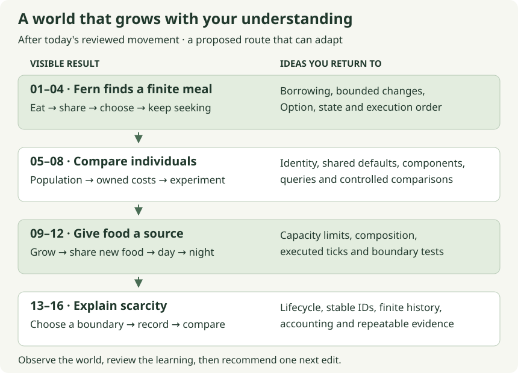

# A small ecosystem, one short session at a time

[Tutorial home](../README.md) · [Today's session](../today-v2.md) · [Current task](../../../NOW.md)

Fern reaching Meadow is the beginning of a useful loop: a condition changes,
an animal finds an opportunity, an action has a cost, and the result changes
what happens next. As the project grows, we will give that loop food,
choice, other animals and an environment. Along the way, Rust's ownership rules
and ECS queries will become tools you have used repeatedly to explain a world.

**Today's movement exercise remains the starting point.** This path begins after its helper
has been reviewed and activated. If you also finish today's meal stretch, you
have already earned some of the first two sessions; use their checks to find
where to resume instead of implementing the same rule again. `NOW.md` continues
to hold the single active edit. Reading ahead does not activate a future feature.

These **16 guides form four proposed learning arcs**. A 20–30 minute focus block
is a design target, not a measured completion time. We can combine familiar
checkpoints, split a difficult one, or change direction when the world raises a
better question. At each arc's review, I will recommend the next useful edit
from what we observed and what you want to understand. A gap between visits
changes where we start the explanation, not what you owe the project.

## Find a session

- [How a short session works](#how-a-short-session-works)
- [Checking your work](#checking-your-work)
- [Arc 1: an animal finds and consumes food](#arc-1-an-animal-finds-and-consumes-food)
- [Arc 2: individuals become an experiment](#arc-2-individuals-become-an-experiment)
- [Arc 3: the environment supplies food](#arc-3-the-environment-supplies-food)
- [Arc 4: scarcity has an explainable consequence](#arc-4-scarcity-has-an-explainable-consequence)
- [Returning after a gap](#returning-after-a-gap)
- [What comes after this path](#what-comes-after-this-path)
- [What is implemented and what is verified](#what-is-implemented-and-what-is-verified)

## How a short session works

Open one session, not the whole month's reading. Its opening reconnects a
familiar result to the next problem. Spend a few minutes following that example,
then make the small edit described in the guide. The final minutes are for the
focused test, review, and one observation or prediction. Complete worked answers
stay visible: tracing an answer you copied is a useful way back into code.

The agent prepares missing signatures, fixtures, imports, IDE actions and browser
plumbing **before** your coding block. Most future sessions need that preparation;
the notice at the top names it. Compilation, tool repair and substantial adapter
work are not silently included in a twenty-minute estimate. If integration finds
an unexpected bug, stop with the focused result understood and resume the same
checkpoint after repair. A short session does not have to grow into an evening.

Some sessions ask you to change a biological rule. Others ask for a test or a
controlled experiment, because being able to diagnose a result is part of owning
this code. Each still ends with something concrete: a function you understand,
a literal assertion that protects an outcome, or a comparison that separates
one cause from another. You do not need to design the surrounding infrastructure
before getting that result.

The growing skill is broader than any one helper. First trace which value a
function changes. Then read a query and predict which entities it reaches.
Later choose a case that distinguishes two possible explanations, and use a
controlled run to decide what to change next. We will return to those abilities
through real edits, with the amount of help adjusted to the part that is new.
There is no separate skills checklist for you to maintain.

The recurring pattern is deliberate. Movement proposed a change before committing
it. A meal does the same thing with two quantities. Growth repeats the bounded
arithmetic. Starvation later asks what a completed tick actually left behind.
These are returns to the same ideas in different contexts, with the earlier
answer available each time. They are not memory tests or prerequisite quizzes.

You can use a worked answer in stages. First follow one input through it; then
edit the small function or assertion selected for the session. If the idea feels
familiar, try the edit before reading the answer. If the syntax is taking all
your attention, keep the answer open and trace what each meaningful piece does.
Both routes end at the same useful question: can you explain why this particular
input produces this result? One changed input, with its answer nearby, gives you
a way to check without turning the session into an examination.

## Checking your work

**The checkpoint for your edit is a test of the live project.** Before a future
session becomes active, I will name its editable symbol, point RustRover at the
prepared test, and put the exact command in the guide and `NOW.md`. I will also
show the expected starting result and the result your edit should establish.
A missing-rule exercise starts red; adding an assertion or investigating a
working scenario may start green. You do not need to invent the test harness
or infer a command from an example name. If those pieces are missing, the
session needs preparation.

The command `check_path_examples.py` has a different role: it checks the complete
answer printed on a page, in a temporary copy. It can pass while your own helper
still contains `todo!()`. Use it only when you want to inspect the answer; running
it is not part of every coding session. Full references remain available so the
guide can be checked, while the smaller trace before each block tells you where
to focus. [How to read an existing Moss test](../context/reading-a-test.md) is a
short optional detour if the testing API is getting in the way.

After your live test passes, review connects it to the whole world. A helper
test protects the calculation; an installed-schedule test checks that the right
entities actually receive it; a browser observation checks that the controls and
inspection expose the result. I handle that integration and update the evidence.
Your stopping point is the one named in the session, not every later check on
the roadmap.



Read the map from top to bottom. Each new arc uses a result from the previous
one: the population experiment needs meaningful actions, sunlight needs a growth
rule to affect, and a death count needs a supply-and-consumption story behind it.
The [ecology plan](../../design/ecology.md) owns the proposed model choices; these
pages explain how to learn and test them in manageable pieces.

<a id="week-1-an-animal-finds-and-consumes-food"></a>

## Arc 1: an animal finds and consumes food

At the end of today's movement work, Fern can reach a destination that the fixture
chose for her. The first arc makes arrival useful, then lets her choose a meal.
We start with the finite transfer so that “found food” has a consequence worth
inspecting. Choosing a destination changes the input to the movement helper;
it does not require throwing away the helper you just wrote.

| Session | The result and the idea it revisits |
| --- | --- |
| [01 · Transfer only the meal that fits](01-bounded-meal.md) | Update energy and biomass through mutable borrows; calculate an allowed change before committing it. |
| [02 · Let two animals share one finite patch](02-a-shared-meal.md) | Follow stable ordering and distinguish an actual meal from a tick's net energy change. |
| [03 · Find a nearby meal](03-finding-food.md) | Borrow a slice of candidates, use `Option` for absence, and make ties deterministic. |
| [04 · Remember when to keep seeking](04-when-to-seek.md) | Use an enum and a small state transition so a grazer can start, continue and stop foraging. |

By this arc's acceptance point, the browser should show a grazer finding and
consuming finite food rather than following a permanent authored instruction.
The word *should* matters: these are future acceptance results, not behavior
already installed by writing this guide. The agent will reconcile helper tests,
installed schedule checks and browser observations before calling the arc done.

The review also follows one small story: a hungry hare reaches a patch, eats,
and either stops seeking or chooses another patch when that opportunity ends.
The agent prepares a short, observable run and pauses at one transition. We
should be able to point to the state that explains it. If the rule works but the
animal spends most of its time doing nothing interesting, that is useful design
feedback, not a reason to add more assertions and ignore the experience.

<a id="week-2-individuals-become-an-experiment"></a>

## Arc 2: individuals become an experiment

One successful grazer tells us the rule works for that example. Several grazers
let us ask whether the rule treats individuals consistently and why their
outcomes differ. We will add an authored population before reproduction, then
make two members of one species pay different maintenance costs. That gives the
attribute/default discussion a visible purpose.

| Session | The result and the idea it revisits |
| --- | --- |
| [05 · Read several individuals](05-many-individuals.md) | Connect species grouping to a summary while preserving the individual values behind it. |
| [06 · Give a cost an owner](06-owned-costs.md) | Write the small resolver that chooses a species default or explicit override for an owned component. |
| [07 · Ask the query for that cost](07-querying-costs.md) | Revisit the original maintenance loop with individual costs and a same-species regression. |
| [08 · Compare one difference fairly](08-a-fair-comparison.md) | Hold the opportunity constant and separate per-tick maintenance from per-cell travel. |

We will retain the two-crate boundary and ordinary components. The first individual
cost component contains a field we already use; it is not a promise to describe
wealth, personality and every future statistic in one framework. Shared travel
settings can remain shared during this comparison. When a specific animal needs
a different travel rate, the movement helper already accepts a concrete rate,
so changing its source is a bounded follow-up rather than an engine replacement.

<a id="week-3-the-environment-supplies-food"></a>

## Arc 3: the environment supplies food

Finite food eventually runs out. Once that loss is trustworthy, regrowth can add
an explicit source without hiding a duplicated meal. We begin under constant
light, making the arithmetic easy to trace, and only then give the simulation
a day and a night. A darker picture will represent a state the simulation owns.

| Session | The result and the idea it revisits |
| --- | --- |
| [09 · Grow within a capacity](09-growing-grass.md) | Reuse the meal's limit calculation for actual biomass production. |
| [10 · Decide who sees new growth](10-growth-meets-meals.md) | Use an installed-order check to show that food grown this tick can be eaten this tick. |
| [11 · Derive a day from ticks](11-a-day-from-ticks.md) | Turn an executed tick into a phase and test the exact day/night boundary. |
| [12 · Let light affect production](12-light-controls-growth.md) | Compose two small rules while keeping rendering and simulation inputs separate. |

The first light model is binary: full daylight permits the configured growth;
night permits none. It is sufficient to create periods of supply and scarcity.
Cloud cover later asks for an explicit policy for fractional production, so it
gets its own change rather than being rounded away inside this lesson. Meadow
remains a patch at one cell. Growing an existing patch does not require a cellular
automaton or a rule for spreading into neighboring cells.

<a id="week-4-scarcity-has-an-explainable-consequence"></a>

## Arc 4: scarcity has an explainable consequence

An animal can currently remain alive at zero energy forever. We preserved that
boundary while learning costs, movement and food. Once the foraging and supply
loop is observable, we can deliberately choose what zero means and inspect the
consequence. This arc adds one narrowly defined terminal rule, then asks whether
a scarcity run tells a coherent story.

| Session | The result and the idea it revisits |
| --- | --- |
| [13 · Choose the starvation boundary](13-deciding-starvation.md) | Evaluate a proposed terminal condition after that tick's allowed feeding; distinguish a model choice from arithmetic. |
| [14 · Remove a life, retain its outcome](14-removal-and-memory.md) | Revisit stable identity and short borrows while checking one removal and one bounded history record. |
| [15 · Read a scarcity run](15-read-a-scarcity-run.md) | Reconcile living counts and resource supply before calling an outcome balanced or broken. |
| [16 · Return to a run you can explain](16-return-and-explain.md) | Compare the same executed inputs and states, keeping camera details out of the claim. |

The proposed policy in session 13 lets this tick's allowed meal rescue an animal
before testing for zero. It is explicitly a future pairing decision. Writing the
lesson does not authorize adding death to today's browser or silently select the
rule on your behalf. If you prefer a different boundary when we reach it, we will
change the worked traces and affected tests together, then continue from the same
learning objective: define eligibility at an exact point in the schedule.

At the end of this route, the intended result is a small foraging ecosystem with
individual costs, renewable food, day/night supply, and an explainable response
to scarcity. Sustained population balance is an experiment, not an acceptance
requirement. Foxes still need their own feeding behavior; a standing fox should
not be presented as evidence that predation has been implemented.

## Returning after a gap

Start with `NOW.md`. You do not have to remember which file implements which
phase, or reconstruct what happened before a break. Tell the agent:

> Continue my short-session learning path. Check the current code and last reviewed
> outcome, prepare the next 20–30 minute piece, and begin with the reminder in that
> guide. Preserve today's unfinished exercise if it is still active.

The agent checks outcomes rather than chapter numbers. A reviewed movement helper
but no browser activation means finish that integration. A meal already completed
in today's stretch means use sessions 01–02 as a short explanation/check, then
continue to selection. A passing reference example alone does not mean the live
feature is complete. If you only have ten minutes, reading the opening example
and tracing its answer is a useful stopping point; the next code edit stays put.

After each reviewed session, the agent maintains one line of progress in the dated
session log and the next concrete edit in `NOW.md`. There is no additional tracker
for you to keep synchronized. The session guides keep stable filenames and links
so your RustRover tabs and bookmarks continue to lead somewhere useful.

## What comes after this path

Flint's first real hunt is the next arc currently proposed after this route,
because it reuses target, movement and terminal-outcome work while making a
second role matter. It is not gated on completing sixteen pages. At the first
live foraging review, we will reconsider whether a second feeding role would
teach more and make the world more interesting than the next planned depth.
The default recommendation remains populations and individual costs, which make
your attribute questions concrete. I will recommend a change if the observed
world gives us a better reason; we will update the route before starting it.

Our proposed pursuit/contact hunt needs pursuit, contact, exclusive claim of one
prey, removal and an actual outcome record. A simpler in-range consumption rule
could begin without pursuit. Neither requires daylight or plant regrowth. Split the proposed
arc into a short prey-selection/pursuit session, a contact-resolution session,
and a competing-hunters regression. One prey must feed at most one hunter, and a
prey claimed earlier in the tick must not act afterward. Death's end-of-tick
starvation policy does not by itself solve that earlier interaction boundary.

Rest and reproduction follow as separate short arcs. Rest needs fatigue with a
rule of its own; standing still must not manufacture nutrition. A first birth
needs an explicit parental cost, a stable child ID and a defined first eligible
tick. Learn the funded transfer before adding inheritance. Then verify that the
newborn does not act during the tick that creates it. This keeps “more life”
connected to accounting and ordering you can inspect.

Weather, movement-speed variation, inheritance and plant spread remain useful
future experiments. Weather can change light supplied to growth; speed can change
accepted distance and its energy cost; inheritance can change a child's baseline
without copying a parent's current reserve. Each has a natural entry point in the
small rules above. None requires an attribute registry, a utility AI framework or
an infinite world before its first useful example.

## What is implemented and what is verified

Every session in this folder is a **future guide** relative to today's live
checkpoint. Each includes a complete worked reference with a test. The examples
are deliberately independent modules, so a declaration inside one is not an
instruction to redeclare that type in the live project. Agent preparation maps
the reviewed example onto the then-current modules and preserves existing rules.

You can run a worked reference now without changing the live code. From the
repository root, for example:

```sh
python3 docs/tutorial/authoring/check_path_examples.py --session 1
```

The script copies the pinned workspace into a temporary directory, extracts the
marked example, and runs its native test using a separate target directory. It
uses cached dependencies and cleans up afterward. Omit `--session` to check all
16 references. It is a way to inspect an answer, not an alternative to implementing
and testing the live exercise. A missing cached dependency is setup work for the
agent, not a Rust exercise.

[Path verification](verification.md) records what actually ran, including the
limits of simplified examples. Live ECS adapters, UI fields, scenario configuration,
schedule changes and browser acceptance are verified only when their sessions
are activated. The [authoring contract](../authoring/README.md) requires the agent
to update prose, tests and that evidence as the project changes.
