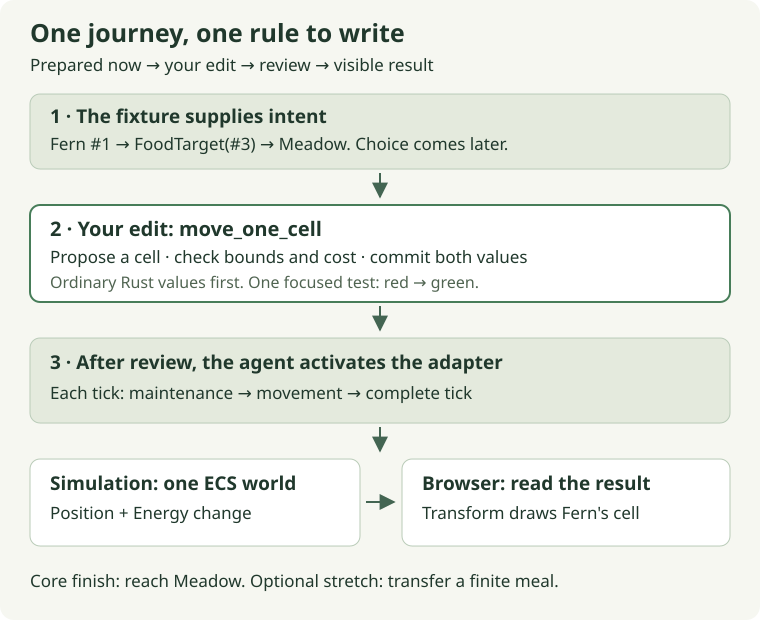

# Today: help Fern reach Meadow

[Guide home](README.md) · Next: [the movement edit](04-movement.md#checkpoint-a--an-affordable-step)

**Start here:** open [`lessons.rs`](../../crates/moss-sim/src/lessons.rs) and
find `move_one_cell`. Replace only that helper's unfinished body, using
[Chapter 4, checkpoint A](04-movement.md#checkpoint-a--an-affordable-step).
Run its focused test, then stop for review and browser activation.

**Status: Ready for the movement helper.** The browser still runs the reviewed
maintenance rule. Movement plumbing is prepared but unscheduled, so an unfinished
helper cannot break the preview. The movement test intentionally fails until you
implement the helper. [The verification record](authoring/verification.md)
separates live checks, isolated worked examples and pending browser acceptance.

Fern is a hare, Flint is a fox, and Meadow is a grass patch. At present the
animals lose energy while standing still. Today's result is specific: Fern walks
to Meadow, pays for the cells she actually travels, and stops there. You will be
able to explain both the position change and the energy change in one tick.

## On this page

- [The change and its reason](#the-change-and-its-reason)
- [Checkpoint A: one executable increment](#checkpoint-a-one-executable-increment)
- [Optional context: one nearby idea](#optional-context-one-nearby-idea)
- [Review and stop](#review-and-stop)

## The change and its reason

We have enough infrastructure to make something move. We will give Fern an
authored target, Meadow's stable ID, so this session can concentrate on carrying
out an action. Finding food autonomously is a later change to how that target
gets chosen. The movement rule can remain the same when we add that behavior.



Follow the diagram from the target to the browser. The target says **where** Fern
is trying to go. Your helper decides whether **one actual step** is possible.
The ECS system supplies the relevant components, and the schedule decides when
that system runs. The renderer then reads the resulting position.

This is a useful place to learn two concepts in context: Rust's mutable borrows
let one operation update position and energy together; ECS queries supply those
values to the operation. Neither concept requires a general attribute framework.
The species/individual override design is retained for a later, visible comparison
between animals rather than made a prerequisite for this first journey.

## Checkpoint A: one executable increment

Treat the following as a flexible session shape, not a deadline. A reviewed
journey is a complete session even if the meal waits.

| Part of the session | Result to aim for |
| --- | --- |
| Settle in, roughly 5–10 minutes | Find `move_one_cell`, its prepared test and the Step button. |
| Write and test, roughly 25–35 minutes | A valid affordable step changes position and energy together. Rejected movement changes neither. |
| Review and observe, roughly 15–20 minutes | The agent activates movement, runs integration checks and helps you see Fern reach Meadow. |
| If there is room in the 60–90 minutes | Prepare and pair on the [finite meal](05-eating.md), then verify food really decreases. |

Start with the prepared test. **Run from the repository root:**

```sh
scripts/with-toolchain.sh cargo test -p moss-sim --locked --test movement movement_charges_only_an_affordable_actual_step -- --exact
```

**Expected before the edit:** exactly one test runs and fails at the unfinished
helper. That identifies the missing rule. A compilation error, a missing test
target or zero matching tests is a setup problem for the agent to fix.

Now use [the movement chapter](04-movement.md#checkpoint-a--an-affordable-step).
It explains the proposed step before showing a complete worked answer. Copying
the answer and tracing its decisions is a valid way to restart; there is no
requirement to solve it from memory.

**Expected after the edit:** that same test reports `1 passed; 0 failed`. It
checks ordinary Rust values, which makes failures easy to inspect. It does not
yet prove that the browser calls the helper. Review connects those two pieces.

If the test fails only on low energy, inspect the order of mutations. The helper
must test affordability before writing either value. Maintenance may clamp to
zero; movement must refuse a step it cannot pay for.

## Optional context: one nearby idea

Your function accepts `&mut Position` and `&mut Energy`: temporary exclusive
access to existing values. It can change the caller's state without owning the
whole ECS world. The target and world configuration are small `Copy` values,
so the helper can receive them by value. [Rust at the point of use](context/rust-at-point-of-use.md)
is available if the syntax interrupts the work.

In the browser, simulation `Position` is the authoritative cell. The visible
sprite's `Transform` is derived from it. Moving the camera changes the view;
moving Fern changes the simulation. That separation lets the native helper test
exercise the same rule the browser will use.

After movement is activated, one Step should take Fern from `(10, 10)` to
`(11, 10)` and reserve 60 to 57: one maintenance unit, then two travel units.
Flint remains still and ends at 59. These are **acceptance targets**, not a claim
that the unfinished live rule has already produced them.

## Review and stop

**Send for review:**

> The movement helper test is green. Review my borrowing, bounds and mutation
> order, then activate the prepared movement system and verify it in the browser.
> If there is time after that, prepare the finite-meal checkpoint for pairing.

The agent handles schedule activation, integration checks, browser rebuilding,
inspection, documentation and a proposed checkpoint commit. You do not need to
reconstruct that work from the guide. The installed order will be maintenance →
movement → complete tick; only reviewed implementations are activated.

After nine Steps from Reset, Fern should reach `(16, 13)` with reserve 33.
Meadow still has 80 biomass. A tenth Step should leave Fern on that cell with
reserve 32: staying still costs no travel, while being alive still incurs
maintenance. Being able to account for that difference is today's core result.

The [meal chapter](05-eating.md) is the stretch. Its helper and test must be
prepared after movement review; it is not another task hidden in this first edit.
Stop after the reviewed journey or the reviewed meal, with `NOW.md` updated to
the next small action.

[Guide home](README.md) · Start coding: [one affordable step](04-movement.md#checkpoint-a--an-affordable-step)
